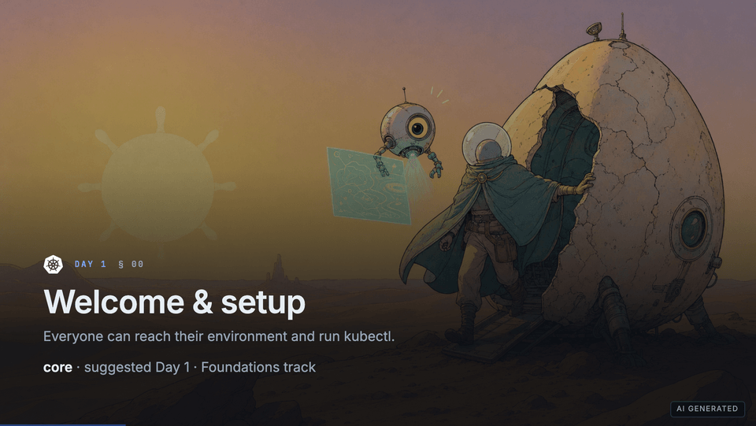

# Kubernetes Practitioner Workshop

[](https://github.com/PlatformRelay/Kubernetes-Workshop/actions/workflows/ci.yml)
[](https://github.com/PlatformRelay/Kubernetes-Workshop/actions/workflows/pages.yml)
[](https://github.com/PlatformRelay/Kubernetes-Workshop/actions/workflows/codeql.yml)
[](https://platformrelay.github.io/Kubernetes-Workshop/)
[](https://github.com/PlatformRelay/Kubernetes-Workshop/releases)
[](./LICENSE)

**Free. Open source. No paywall.** A vendor-neutral Kubernetes workshop you can run for
yourself, for colleagues, or as a full multi-day delivery — with interactive slides,
ready-to-run labs, a portable quiz prototype, and downloadable PDFs.

Use it to **learn**, to **explain Kubernetes concepts to your team**, or to **facilitate**
a room. Restyle it, reorder it, fork it, redistribute it, or sell it under the
[0BSD License](./LICENSE) — no attribution required. No royalties, no accounts, and no
telemetry.

**Live decks** (always-current GitHub Pages builds):

- [Day 1 — Foundations](https://platformrelay.github.io/Kubernetes-Workshop/deck/day-1/)
- [Day 2 — Running workloads](https://platformrelay.github.io/Kubernetes-Workshop/deck/day-2/)
- [Day 3 — Security, delivery, operators](https://platformrelay.github.io/Kubernetes-Workshop/deck/day-3/)
- [Canonical 3-day cut](https://platformrelay.github.io/Kubernetes-Workshop/deck/3day/) ·
  [Full content (superset)](https://platformrelay.github.io/Kubernetes-Workshop/deck/) ·
  [Docs home](https://platformrelay.github.io/Kubernetes-Workshop/)

## Try it in sixty seconds

| | |
| --- | --- |
| **Docs home** | <https://platformrelay.github.io/Kubernetes-Workshop/> |
| **Live decks** | [Day 1](https://platformrelay.github.io/Kubernetes-Workshop/deck/day-1/) · [Day 2](https://platformrelay.github.io/Kubernetes-Workshop/deck/day-2/) · [Day 3](https://platformrelay.github.io/Kubernetes-Workshop/deck/day-3/) · [3-day cut](https://platformrelay.github.io/Kubernetes-Workshop/deck/3day/) · [Superset](https://platformrelay.github.io/Kubernetes-Workshop/deck/) |
| **PDF handouts** | [GitHub Releases](https://github.com/PlatformRelay/Kubernetes-Workshop/releases) (day + full + 3-day PDFs on each `v*` tag) |
| **Labs** | [`labs/README.md`](./labs/README.md) · start at [`labs/day-1/00-setup.md`](./labs/day-1/00-setup.md) |
| **Quizzes** | [`quiz/README.md`](./quiz/README.md) (portable prototype; FOSS live host still open) |
| **Run slides locally** | [`docs/run-slides.md`](./docs/run-slides.md) (Node.js + pnpm) |
| **Known limitations** | [`docs/beta-limitations.md`](./docs/beta-limitations.md) (S24 stub; add-on smoke backlog) |



<sub>Real deck, no hand-taken screenshots: CI re-renders this tour from the slide sources
(`pnpm showcase:gif`). Static frame: [`docs/images/deck-preview.png`](docs/images/deck-preview.png).</sub>

## What you get

- **~50% slides / ~50% practice** — Slidev decks paired with standalone Markdown labs.
- **A clear red line** — one app grown **Pod → Deployment → Service → Ingress → Gateway API**,
  then config, storage, probes, security, Helm, GitOps, and operators on the same workload.
- **Two lab environments** — assigned namespace on a shared cluster, or a local **kind**
  cluster via [`./workshop up`](./docs/setup.md).
- **Facilitator support** — syllabus, pacing notes, and add-on checklists in
  [`docs/facilitator-guide.md`](./docs/facilitator-guide.md).
- **Offline PDFs** — every release exports day decks plus full/3-day compatibility PDFs.

## Audience

**Beginner-to-intermediate.** Comfortable in a shell, with basic Git, YAML, HTTP, and
container vocabulary. Container on-ramp labs (S01/S02) need no cluster.

**By the end, a learner can** build and secure an image; explain the control plane;
author and operate core workloads through Gateway API; inject config and storage; set
resources and probes; harden with PSA, NetworkPolicy, and RBAC; deliver with Helm and
GitOps; and read an operator in the wild — mapped to CKA/CKAD domains as a design check
(cert prep is not the organizing principle).

## Curriculum at a glance

The workshop is a **superset of 28 sections** (`S00`–`S27`), boiled down per delivery into a
**canonical 3-day cut**. Spine: **Pod → Deployment → Service → Ingress → Gateway API**
(`S05`–`S09`).

| Day | Theme | Sections |
| --- | --- | --- |
| **Day 1** | Foundations + red line | `S00`, `S03`–`S08` |
| **Day 2** | Running workloads well | `S09`–`S14` |
| **Day 3** | Security, delivery, operators | `S17`, `S20`–`S23`, `S25`–`S27` |

Authored on-ramp / add-back sections (`S01`, `S02`, `S15`, `S16`, `S18`, `S19`) live in
**Optional / Appendix**; `S24` is a deferred stub (not schedulable).
**26 of 28 sections are fully authored** (`S27` slides-only wrap-up). Full map:
[`docs/syllabus.md`](./docs/syllabus.md) — contract-checked against
`scripts/deck-manifest.mjs`.

## Choose your path

- **Preview** — [documentation site](https://platformrelay.github.io/Kubernetes-Workshop/) and
  [live decks](https://platformrelay.github.io/Kubernetes-Workshop/deck/) ·
  [PDF releases](https://github.com/PlatformRelay/Kubernetes-Workshop/releases).
- **Participate** — [`labs/README.md`](./labs/README.md), then Lab 00. For kind:
  [`docs/setup.md`](./docs/setup.md).
- **Facilitate** — [`docs/facilitator-guide.md`](./docs/facilitator-guide.md).
- **Contribute** — authoring rules in [`AGENT.md`](./AGENT.md).

## Run the slides on your machine

Complete copy-paste path (Node 22 + pnpm — this repo does not ship an npm lockfile):

```bash
git clone https://github.com/PlatformRelay/Kubernetes-Workshop.git
cd Kubernetes-Workshop

corepack enable
corepack prepare pnpm@11.9.0 --activate
pnpm install --frozen-lockfile

pnpm dev:day1          # http://localhost:3030/ — or pnpm dev / dev:3day / dev:superset
```

More detail (build, preview, Pages tree): [`docs/run-slides.md`](./docs/run-slides.md).

## Develop (maintainers)

```bash
pnpm install
pnpm dev                # gum menu when available
pnpm deck -- --list
pnpm build              # live day entries
pnpm export             # PDFs (playwright-chromium)
pnpm lint && pnpm link-check
pnpm test:pages         # Pages wiring contract
pnpm pages:build        # MkDocs + hash-routed decks → ./site (needs MkDocs)
```

## Layout

| Path | Purpose |
| --- | --- |
| `docs/` | MkDocs documentation (GitHub Pages landing) |
| `scripts/deck-manifest.mjs` | Section metadata + generated deck membership |
| `slides-day-{1,2,3}.md` | Live day entries |
| `slides.md` / `slides-3day.md` | Compatibility superset / three-day cut |
| `pages/SNN-topic/` | Section sources |
| `labs/day-*/` | Standalone labs |
| `quiz/` | Portable quiz prototype |
| `theme/` | Local Slidev theme |
| `docs/decisions/` | ADRs |

## Continuous integration & publishing

| Workflow | Trigger | Role |
| --- | --- | --- |
| `ci.yml` | PR + `main` | Labs lint, deck builds, link-check, Pages contract tests, showcase GIF |
| `pages.yml` | `main` (+ manual) | MkDocs + Slidev → GitHub Pages |
| `release.yml` | `v*` tags | PDF + offline zip GitHub Release |
| `lab-smoke.yml` | schedule / dispatch / PR subset | Disposable kind Day-1 smoke |
| `codeql.yml` | `main` / schedule | Code scanning |

Release policy (immutable tags, day-deck artifacts): [`docs/release.md`](./docs/release.md).

## License

**[0BSD](./LICENSE)** — use, copy, modify, redistribute, and sell freely. No attribution
required. Copyright (C) 2026 Platform Relay.
