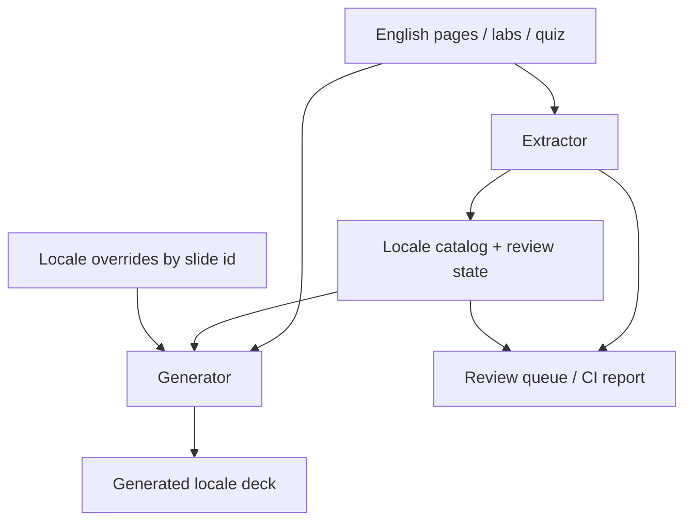

# Option: Extracted catalogs + generated decks + locale overrides

- **Cluster:** sidecar-catalog (+ selective locale structure)
- **When translation happens:** CI-generate (author-time English; locale at compose)
- **Parent:** [ADR 0014](../0014-i18n-without-forking.md) (proposed catalog; not accepted)
- **Role:** primary full-corpus candidate — slides, labs, quiz — with overflow escape hatch

> **Architecture follow-up:** the
> [Workshop Localization Hub architecture pack](../0014-tms-architecture/README.md) turns this
> sketch into a mature standalone design. It delegates translation memory, glossary, translator UI,
> and linguistic review to external TMS products while the hub owns extraction, provider
> conformance, composition, visual review, and release.

## Shape

English markdown stays the concrete, readable source. A tool walks each surface, extracts
translatable nodes into a sidecar catalog, and leaves fences alone. Locale trees are
**generated**. Where a 1:1 string swap would overflow or mis-teach, a locale may **override** a
slide (replace one English slide with one or more locale slides) keyed by a stable slide id.



### Layers

| Layer | What it holds | When to use |
| --- | --- | --- |
| Catalog | msgid → msgstr for prose, kickers, notes, quiz fields | Default for every string |
| Review state | `fuzzy` / `needs-review` / `accepted` + English hash | On every English change |
| Overrides | Full Slidev markdown fragments for `de` / `pt-BR` / … | Overflow, reflow, or pedagogy that cannot be 1:1 |
| Generated output | Composed locale `pages/` (and lab/quiz renders) | What Slidev and facilitators run — never hand-edited |

Facilitators compose with something like `task dev --lang de` (same idea as `--gitops`).

## Stale tracking and human validation

1. English edit → extractor recomputes string ids / content hashes.
2. Changed or removed source strings mark locale rows **fuzzy** (or drop obsolete ids).
3. AI may propose replacements for fuzzy rows; status stays `needs-review` until a human accepts.
4. A report (CI artifact or `task i18n:status`) lists open fuzzy / needs-review per locale.
5. Policy (later ADR): fail the locale export if open fuzzy remain, or fall back to English for
   those nodes — never invent unmarked strings.

Illustrative catalog metadata (format TBD — gettext, XLIFF, or JSON):

```yaml
# i18n/de/strings.yaml (illustrative)
- id: S00.statement-why.kicker
  source: "Why we're here"
  sourceHash: "a1b2…"
  target: "Warum wir hier sind"
  status: accepted   # fuzzy | needs-review | accepted
- id: S00.statement-why.body
  source: "Three days to take you from…"
  sourceHash: "c3d4…"
  target: "In drei Tagen…"
  status: fuzzy      # English changed; human must revalidate
```

## How the same slide looks

**English source (today)** — unchanged authoring surface
([`pages/S00-welcome/index.md`](../../../pages/S00-welcome/index.md)):

```md
---
layout: statement
kicker: Why we're here
slideId: S00.statement-why
---

Three days to take you from **"what is a container"** to confidently
**authoring, running, and operating** core Kubernetes workloads.
```

(`slideId` is illustrative — it may be frontmatter or a comment marker, but must be explicit,
immutable, and independent of file path or slide index.)

**Catalog path (fits):** generate one German slide from msgstr.

**Override path (overflow — e.g. German too long for one statement slide):**

```md
# i18n/de/overrides/S00.statement-why.md
# Replaces English slide S00.statement-why with TWO slides for de

---
layout: statement
kicker: Warum wir hier sind
---

In drei Tagen von **"was ist ein Container"** zu
**Workloads in Kubernetes sicher erstellen, betreiben und betreiben**.

---
layout: statement
kicker: Das Versprechen
---

Die Hälfte der Zeit ist Folien, die Hälfte Tastatur:
jeder Konzeptblock endet mit einem Lab **in eurer eigenen** Umgebung.
```

Generator rule: if `i18n/<lang>/overrides/<slideId>.md` exists, emit that fragment instead of
catalog-substituted English; otherwise substitute strings in place. Overrides are themselves
subject to review when the English `sourceHash` for that slide id changes (flag the whole
override for human revalidation).

## What stays untranslated

Lab and slide fences stay byte-identical across locales (including inside overrides — CI must
still assert fence equality for shared curriculum commands):

```bash
kubectl apply --dry-run=server -f pod.yaml
kubectl apply -f pod.yaml
```

API kinds, `kubectl`, image refs, and flag names stay in a do-not-translate glossary.

## Comparing alternatives under these requirements

| Requirement | Catalogs + overrides (this) | Parallel trees (#55) | `$t()` keys | Captions only | Quiz/labs first |
| --- | --- | --- | --- | --- | --- |
| Full localize (slides too) | Yes | Yes | Yes | No | No |
| English stays readable | Yes | Yes (EN tree) | No | Yes | Yes |
| Auto stale / retranslate | Built-in fuzzy | Manual / custom bot | Tooling-dependent | Weak | Yes on subset |
| New/split slides for DE | Override files | Free rewrite | Conditionals / extra components | No | N/A for slides |
| Drift risk | Low if CI enforced | High | Medium | Low | Low on subset |

**Why not pure catalogs without overrides?** German length will overflow; facilitators would
silently ship clipped slides or shrink fonts. Overrides are the escape hatch without forking the
whole library.

**Why not parallel trees for overflow?** They solve layout by copying everything, then lose
automatic fuzzy tracking unless you rebuild the same catalog machinery anyway.

## Consequences

| Dimension | Effect |
| --- | --- |
| Editability | English markdown stays readable; overrides are rare, explicit, per slide id. |
| Drift | Fuzzy + review queue + fence-identity CI. |
| Third language | New catalog + optional overrides directory. |
| AI | Draft fuzzy / draft override prose; human accept. |
| Fit to 0003 | Strong — one English library; locales are generated composition. |
| Cost | Highest of the three full sketches: Slidev round-trip + override composer + review UX. |
| Honesty | Full locale workshop is the goal; captions/quiz-first are not substitutes. |
