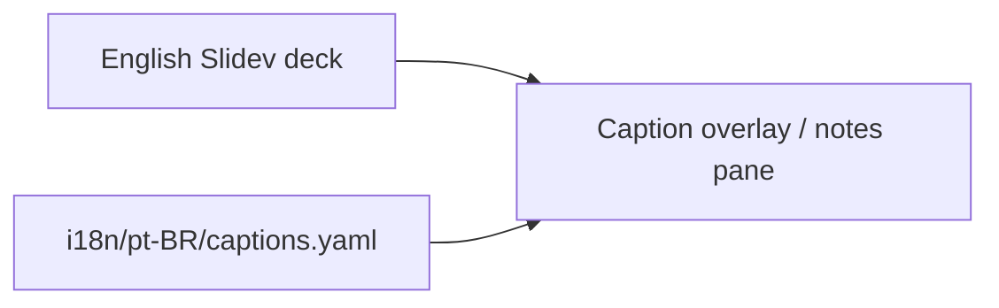

# Option: Caption / subtitle track

- **Cluster:** shrink-the-problem
- **When translation happens:** author-time (sidecar track; English deck unchanged)
- **Parent:** [ADR 0014](../0014-i18n-without-forking.md) (proposed catalog; not accepted)
- **Role:** overlay / stopgap only — **does not meet** the full-corpus localization goal

## Shape

The English section library is never forked. A sidecar maps `section + slide index` (or a stable
slide id) to locale captions and optional speaker notes. The projector shows English; the room can
follow a Portuguese track (on-screen caption layer, presenter notes pane, or printed companion).

If the workshop goal is a full locale deck (including German overflow handled by real slides), use
[option 01 — catalogs + overrides](01-extracted-catalogs-generated-decks.md) instead.



This is the cheapest landing zone for a full-prose contribution like PR #55 without accepting a
parallel tree: harvest captions and notes into the track; leave `pages/` alone.

## How the same slide looks

**English source (today)** — still the only slide file
([`pages/S00-welcome/index.md`](../../../pages/S00-welcome/index.md)):

```md
---
layout: statement
kicker: Why we're here
---

Three days to take you from **"what is a container"** to confidently
**authoring, running, and operating** core Kubernetes workloads.
```

**Sidecar track** (illustrative):

```yaml
# i18n/pt-BR/captions.yaml
S00:
  - slide: statement-why   # or 0-based index within the section
    kicker: Por que estamos aqui
    caption: >
      Três dias para levar você de "o que é um container" a criar,
      executar e operar workloads Kubernetes com confiança.
    speaker: >
      Diga o resultado em voz alta. O contrato 50/50 é a promessa do
      workshop — cada ideia é praticada na hora.
```

The markdown on disk does not change. The locale never becomes a second `index.md`.

## What stays untranslated

Everything on the projector that is curriculum YAML/bash — and, in this option, **most of the
slide body itself** stays English by design. Lab fences are untouched:

```bash
kubectl apply --dry-run=server -f pod.yaml
kubectl apply -f pod.yaml
```

## Consequences

| Dimension | Effect |
| --- | --- |
| Editability | English library untouched; zero freeze of authoring. |
| Drift | Track can lag; missing keys fall back to English captions or show nothing. |
| Third language | Another track file; still one deck. |
| AI | Can draft caption rows; human review still required for teaching terms. |
| Fit to 0003 | Strong — does not invent a second library. |
| Honesty | This is a Portuguese *overlay*, not a Portuguese workshop. Learners still read English slides. |
| Cost | Low engineering; does not satisfy "full locale deck" expectations. |
