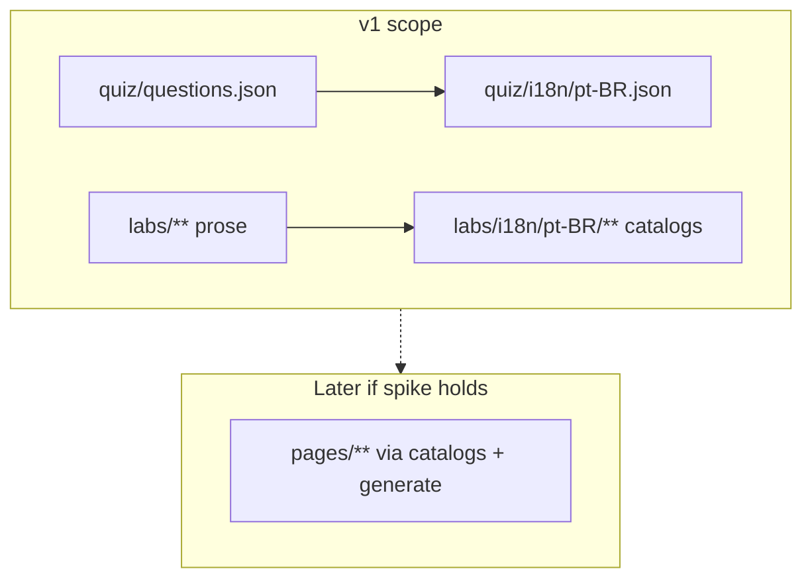

# Option: Quiz and lab prose first

- **Cluster:** shrink-the-problem → path into sidecar-catalog
- **When translation happens:** author-time / CI on structured surfaces first
- **Parent:** [ADR 0014](../0014-i18n-without-forking.md) (proposed catalog; not accepted)
- **Role:** incremental **spike path** toward catalogs — **not** the final answer if slides must be localized too

## Shape

Defer Slidev AST round-trip risk while proving fuzzy tracking and fence identity. Localize surfaces
that are already structured (then extend to slides via
[option 01](01-extracted-catalogs-generated-decks.md)):

1. **Quiz** — [`quiz/questions.json`](../../../quiz/questions.json) keyed by ids like
   `S00-Q-RET-01`. A locale file overrides `prompt` / `options[].text` / `explanation` by id.
2. **Lab prose** — extract paragraphs and headings from `labs/day-*/NN-topic.md`; leave fenced
   bash/YAML identical.

The projector (slides) stays English — often correct for Kubernetes teaching vocabulary. This
proves catalog discipline before betting on ~400 slides.



## How the same slide looks

**Slides:** unchanged. The S00 statement slide stays English on the projector:

```md
---
layout: statement
kicker: Why we're here
---

Three days to take you from **"what is a container"** to confidently
**authoring, running, and operating** core Kubernetes workloads.
```

**Quiz locale** (illustrative override by id):

```json
{
  "S00-Q-RET-01": {
    "prompt": "Uma tarefa do lab parece travada. O que este workshop garante sobre cada tarefa e pergunta?",
    "options": {
      "spoiler": "Cada tarefa e pergunta tem um spoiler recolhido com a solução ou saída esperada.",
      "ask-later": "As respostas ficam retidas até o quiz ao vivo revelá-las no fim do dia.",
      "exam-mode": "As tarefas ficam sem solução de propósito para a sala fazer um exame."
    },
    "explanation": "Todo lab envia um spoiler em <details> para o aluno destravar sem esperar o facilitador."
  }
}
```

**Lab prose catalog** (illustrative) vs fence left alone:

```yaml
# labs/i18n/pt-BR/05-pod.yaml
objective: >
  Criar, executar, inspecionar e apagar um Pod — a menor unidade implantável —
  e observar o ciclo de vida.
```

```bash
# still English in labs/day-1/05-pod.md — never translated
kubectl apply --dry-run=server -f pod.yaml
kubectl apply -f pod.yaml
```

## What stays untranslated

All executable fences and happy-path manifests. Slide library (in v1). API kinds and kubectl in a
glossary even when lab prose is localized.

## Consequences

| Dimension | Effect |
| --- | --- |
| Editability | Slides stay English; quiz/labs gain catalogs without key-souping the deck. |
| Drift | Id-stable quiz keys are easy to merge; lab catalogs need the same fuzzy story as option 01. |
| Third language | Another quiz JSON + lab catalog set. |
| AI | Strong fit: quiz options are short strings with clear glossary rules. |
| Fit to 0003 | Neutral for slides (unchanged); prepares the catalog toolchain ADR 0003 composition would reuse. |
| Honesty | Industry language on the projector, local language on the keyboard — a deliberate teaching choice. |
| Cost | Lowest spike cost; does not deliver localized slides. |
