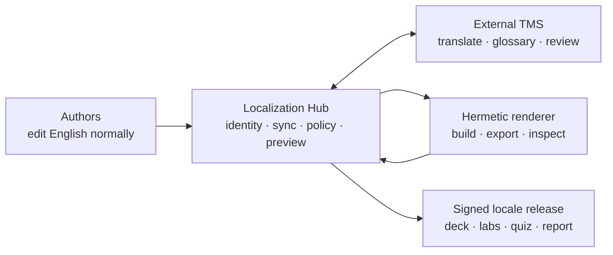

# Workshop Localization Hub: architecture pack

- **Status:** partially superseded (2026-08-15) — the domain model, identities, and policies were
  adopted; the service runtime (database, queue, portal, webhooks) and the dual-live-adapter
  requirement were **cut** after critical review. The optimized decision set lives in the
  standalone [`PlatformRelay/workshop-i18n`](https://github.com/PlatformRelay/workshop-i18n)
  repository (`docs/adr/0001–0011` there triage this pack's twelve proposed ADRs). See the
  "Critical review and optimized cut" section of [ADR 0014](../0014-i18n-without-forking.md).
  This pack is preserved as the domain analysis it is.
- **Target home (as realized):** `workshop-i18n` (the provisional `workshop-localization-hub`
  name was rejected as promising the deleted service tier)
- **Audience:** workshop maintainers, translators, reviewers, facilitators, and implementers
- **Parent decision:** [ADR 0014](../0014-i18n-without-forking.md)

This pack describes a mature localization control plane shared by multiple workshops. It is not a
proposal to build a general-purpose translation editor. Translators and linguistic reviewers work in
an established translation-management system (TMS); the hub owns the workshop-specific problems
those products do not solve:

- extracting translatable content from Slidev, lab Markdown, and structured quizzes;
- preserving executable examples and Slidev structure exactly;
- maintaining durable identities across source edits and file moves;
- synchronizing more than one TMS through one tested adapter contract;
- rendering locale previews and detecting clipping or structural damage;
- governing whole-slide overrides and source-change invalidation;
- releasing only linguistically and visually approved workshop snapshots.

The phrase “every story in multiple TMSs” is interpreted as two requirements:

1. every supported user story must pass against every production TMS adapter; and
2. every user story must be covered by more than one test layer.

If only the second meaning was intended, the adapter architecture remains valuable: it prevents the
workshops from becoming locked to one provider.

## Reading map

| Question | Document |
| --- | --- |
| What are we building and where are the boundaries? | [System architecture](system-architecture.md) |
| What does it feel like for each person? | [Usability and journeys](usability-and-journeys.md) |
| Which outcomes must work in every TMS? | [User stories and traceability](user-stories-and-traceability.md) |
| What are the entities, identities, and states? | [Domain model and contracts](domain-model-and-contracts.md) |
| How do repositories and TMS products integrate? | [Integration architecture](integration-architecture.md) |
| How will the first TMS authority be selected? | [TMS evaluation](tms-evaluation.md) |
| How is “extremely well tested” made enforceable? | [Testing strategy](testing-strategy.md) |
| How is it operated, secured, and recovered? | [Operations and security](operations-and-security.md) |
| How can it be delivered without a big-bang migration? | [Delivery plan](delivery-plan.md) |
| Which choices are deliberate and reversible? | [Proposed standalone-repository ADRs](adrs/README.md) |

## Decision summary

The preferred implementation is a **modular monolith with asynchronous workers**, a PostgreSQL
database, an S3-compatible artifact store, and a small web application plus CLI. The first release
may run as a CLI and CI job using the same domain modules; the service adds collaboration and
operational visibility without changing the content model.

## Non-goals

- Reimplementing a translation editor, translation memory, glossary, terminology suggestions, or
  machine translation.
- Translating executable fences, Kubernetes API identifiers, image references, paths, or flags.
- Editing English source through the hub.
- Treating generated locale Markdown as hand-maintained source.
- Guaranteeing layout from character-count heuristics alone.
- Allowing an external TMS webhook to publish a workshop release directly.

## Success criteria

The architecture is acceptable only when a representative, hostile section—not a trivial title
slide—can complete this loop through at least two adapters:

1. extract and publish translation units;
2. translate and review them in the external TMS;
3. import targets repeatedly without duplication or lost review state;
4. compose normal and overridden slides;
5. prove protected content and structural invariants;
6. render live deck and PDF previews;
7. reject clipping and unreviewed content;
8. publish an immutable, reproducible locale snapshot;
9. invalidate exactly the affected approvals after an English edit; and
10. recover from duplicate, delayed, and out-of-order webhooks.

## Standards and product references

- [XLIFF 2.1](https://docs.oasis-open.org/xliff/xliff-core/v2.1/xliff-core-v2.1.html)
  defines interoperable localization units, inline codes, states, metadata, validation, and size
  restrictions. It is the archival portability target, not an assumption that every provider
  accepts every XLIFF 2.1 feature.
- [GNU gettext fuzzy entries](https://www.gnu.org/software/gettext/manual/html_node/Fuzzy-Entries.html)
  establish the important principle that changed matches require human revision.
- [Weblate workflow configuration](https://docs.weblate.org/en/latest/admin/projects.html) documents
  review workflow, quality-based commits, and shared/workspace translation memory.
- [Weblate Markdown support](https://docs.weblate.org/en/latest/formats/markdown.html) is useful
  evidence but explicitly remains under development; raw Slidev Markdown must therefore be spiked,
  not trusted by assertion.
- [Weblate XLIFF 2 support](https://docs.weblate.org/en/latest/formats/xliff2.html) is likewise
  documented as under development. Adapters must prove the exact profile they use and may prefer a
  provider's native string API over file ingestion.
