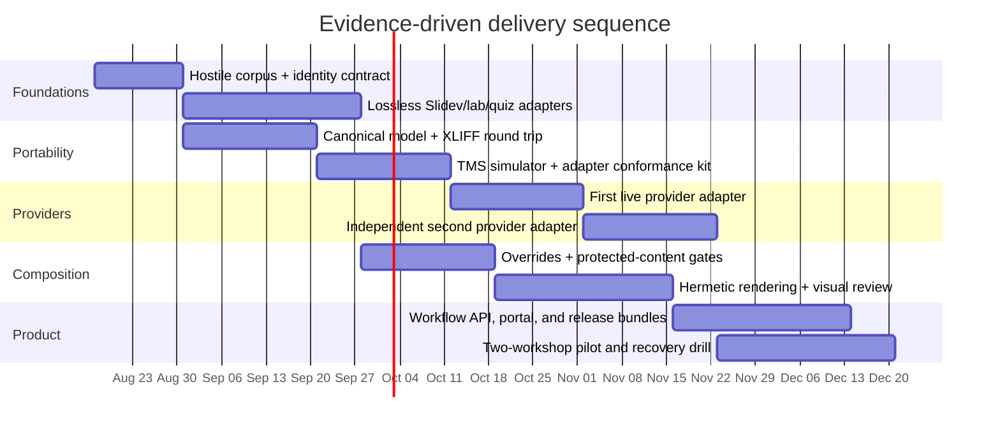
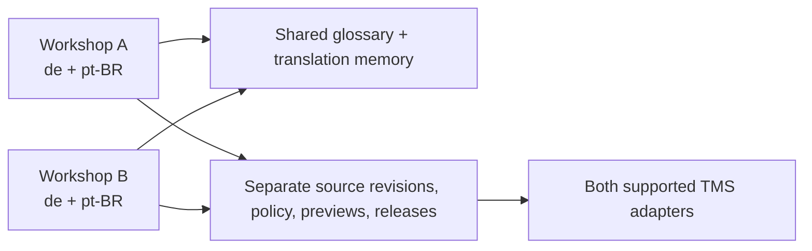

# Delivery plan

The plan proves risk in descending order. It does not start with dashboards or a production
deployment while the Slidev round trip remains unknown.

## Delivery map



Dates are illustrative sequencing, not estimates or commitments.

## Phase 0: decision fixtures

Deliverables:

- explicit slide/unit identity proposal;
- a hostile corpus sampled from both workshops;
- protected-term and protected-syntax contract;
- executable stories for author, translator, reviewers, facilitator, and operator;
- threat model; and
- accepted ADRs for the standalone repository.

Exit evidence:

- the corpus includes every syntax construct used by either workshop;
- every story maps to multiple planned test layers; and
- maintainers agree on the visible user journeys before implementation.

## Phase 1: local deterministic engine

Build a CLI with no database or external provider dependency:

```text
hub inspect <workshop>
hub extract <workshop> --out bundle.xlf
hub compose <workshop> --locale de --targets bundle.xlf
hub verify <composition>
hub render <composition>
hub impact <old-revision> <new-revision>
```

The CLI uses the final domain and content-adapter packages. It is not throwaway spike code.

Exit evidence:

- source-language round trip is semantically lossless;
- protected skeletons cannot be mutated through target input;
- German and Portuguese compositions build for the representative corpus;
- override/split behavior is deterministic; and
- parser property/fuzz tests run continuously.

## Phase 2: TMS contract and first adapter

Build the deterministic TMS simulator before a live adapter. The simulator exposes pagination,
webhooks, review states, rate limits, failures, and controllable ordering.

Exit evidence:

- adapter contract runs identically against simulator and first live provider sandbox;
- translation IDs and review state survive source edits, moves, obsolete units, and retries;
- XLIFF export/import retains all required data; and
- translators approve the editor context and deep-link journey.

## Phase 3: independent second adapter

The second adapter is an architecture test, not a checkbox. It should be implemented by someone who
did not author the first adapter where practical, using only the contract and conformance kit.

Exit evidence:

- both adapters pass all mandatory live scenarios;
- no provider-specific type appears outside adapter packages;
- one locale migrates between providers through portable exports without identity loss; and
- shadow comparison reports normalized behavioral differences.

## Phase 4: service and collaboration UX

Add PostgreSQL, durable queue, object storage, API, role-specific portal, and webhook ingestion around
the proven engine.

Exit evidence:

- all CLI behaviors remain available and use the same application services;
- author impact checks, translator links, linguistic state, visual review, and release dashboard work
  end to end;
- duplicate/out-of-order event tests and worker-kill tests pass; and
- accessibility/usability sessions complete for each role.

## Phase 5: hermetic rendering and release

Exit evidence:

- every click state of the representative locale decks is rendered;
- structural and automated visual checks locate findings at slide/click coordinates;
- human visual approval binds to exact render inputs;
- incomplete or fallback-containing locales cannot publish;
- release bundles reproduce from recorded inputs; and
- rollback/withdrawal leaves an auditable replacement path.

## Phase 6: two-workshop pilot



The pilot must exercise both workshops, two locales, both TMS adapters, normal catalog composition,
at least one slide split, and one provider migration rehearsal.

Exit evidence:

- facilitators run released locale bundles without hub/operator assistance;
- a real English change produces correct selective invalidation;
- terminology reuse is visible across workshops without leaking workflow state;
- a full backup restore reproduces a released artifact;
- operating SLOs and alert runbooks are demonstrated; and
- maintainers explicitly decide whether the usability warrants production adoption.

## Go/no-go checkpoints

| Checkpoint | Stop or redesign when… |
| --- | --- |
| Parser | real Slidev syntax cannot round-trip without frequent source rewrites |
| Translator UX | protected syntax or fragmented strings make normal translation unsafe |
| Override model | overrides become common enough to constitute a locale fork |
| Provider portability | required state/inline codes cannot survive both adapters |
| Visual QA | automated findings are too noisy to guide reviewers |
| Operations | recovery cannot reproduce a historical release |
| Product UX | facilitators or translators require repository internals for routine work |

## Initial backlog by user outcome

| Epic | First demonstrable story |
| --- | --- |
| Source intake | An author sees which reviewed German units become stale before merging English |
| Translation | A translator edits prose with code protected and opens the source screenshot in one click |
| Linguistic review | A reviewer accepts a target and the hub imports one normalized state change |
| Composition | A reviewed German target produces valid Slidev without changing fenced YAML |
| Overrides | A reviewer splits one crowded German slide and sees both target slides rendered |
| Visual review | A reviewer sees clipping coordinates and approves the exact corrected composition |
| Release | A facilitator downloads one verified locale bundle with zero fallback units |
| Multi-provider | The same source-change story passes against both TMS adapters |
| Recovery | An operator replays duplicate/out-of-order events with no duplicate semantic change |
| Portability | A locale migrates between providers without losing stable identities or accepted targets |

