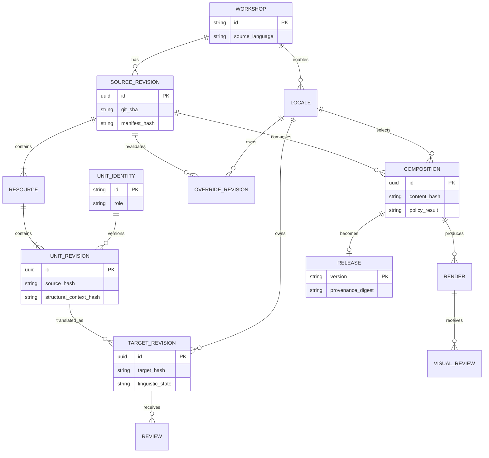
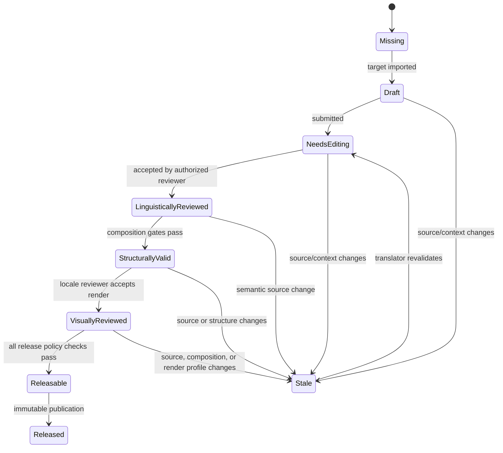
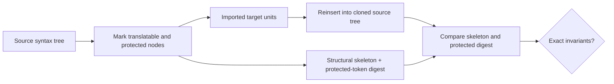
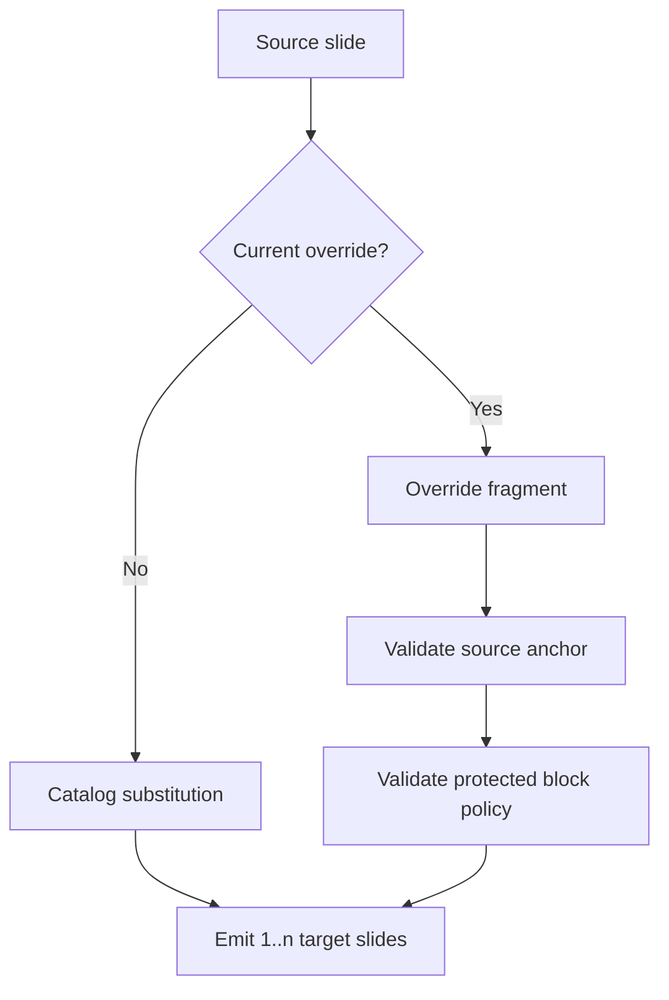

# Domain model and contracts

## Canonical model

The hub uses a small canonical localization model (CLM) internally and a versioned XLIFF profile for
portable archive/import/export. The CLM is optimized for domain logic. An adapter may map the CLM to
a provider's native string API or to the exact interchange profile that provider supports; provider
format limitations do not weaken the canonical model.



## Identity hierarchy

```text
workshop:kubernetes-practitioner
└── resource:pages/S07-service/index.md
    └── slide:S07.service-types
        ├── unit:kicker
        ├── unit:title
        ├── unit:card.cluster-ip.heading
        ├── unit:card.cluster-ip.body
        └── unit:speaker-note.mental-model
```

Rules:

1. IDs are explicit, semantic, immutable, and unique inside a workshop.
2. File paths and ordinal positions are mutable locations, never identities.
3. A source hash detects text change; it is not the unit ID.
4. A structural-context hash detects changes that may affect meaning or layout even when text does
   not change—for example a card moving to a more constrained layout.
5. Renaming an ID is an explicit migration with an alias, never delete-and-recreate.
6. A deleted unit becomes obsolete but remains queryable for translation-memory provenance.

## Unit shape

```yaml
apiVersion: localization.workshops.dev/v1alpha1
kind: LocalizationUnit
metadata:
  workshop: kubernetes-practitioner
  resource: pages/S07-service/index.md
  slide: S07.service-types
  id: card.cluster-ip.body
spec:
  role: prose
  sourceLanguage: en
  source: >-
    A stable in-cluster virtual IP. Reachable only from inside the cluster.
  sourceHash: sha256:...
  structuralContextHash: sha256:...
  context:
    layout: default
    component: KwCard
    headingUnit: card.cluster-ip.heading
    screenshot: artifact://sha256/...
  inlineCodes:
    - token: p1
      source: <strong>in-cluster</strong>
      canDelete: false
      canReorder: true
  constraints:
    protectedTerms: [ClusterIP]
    sizeHint:
      sourceRenderedWidthPx: 284
      targetBudgetRatio: 1.35
```

Portable interchange should use XLIFF inline-code and metadata facilities instead of embedding this
illustrative YAML in provider projects. Provider adapters must document and test any downgraded or
native representation.

## Translation state

Provider-specific states are normalized into a strict hub state machine.



`Released` is immutable. A correction produces a new release; audit history is never rewritten.

## Change classification

Not every English edit should destroy all approval, but preserving approval must be conservative.

| Change | Translation state | Visual state |
| --- | --- | --- |
| Whitespace-only outside protected syntax | Preserve | Preserve if composed hash unchanged |
| Source location/file move with same explicit ID | Preserve | Preserve if render inputs unchanged |
| Punctuation or prose edit | Needs editing | Invalidate |
| Protected code change | Needs editing or policy-defined carry-forward | Invalidate |
| Layout/component/context change | Preserve language provisionally | Invalidate visual approval |
| Unit split/join | Needs editing; offer translation-memory candidates | Invalidate |
| Slide override source anchor changes | Mark entire override stale | Invalidate |
| Render toolchain/profile changes | Preserve language | Invalidate visual approval |

The first version should classify only exact-equal versus changed. Smarter semantic classification can
be introduced after false-preservation tests demonstrate safety.

## Protected-content model



Protected content includes:

- fenced code blocks and their info strings;
- inline code unless explicitly marked translatable;
- component names, prop names, directives, expressions, and event handlers;
- frontmatter keys and non-translatable values;
- URLs, image references, file paths, flags, resource names, and quiz answer IDs;
- slide separators, imports, click sequencing, and conditional structure.

“Byte-identical” applies where the parser can preserve raw source slices. The stronger system-level
invariant is that the protected token sequence and syntax skeleton are identical after composition.

## Override model

An override is a versioned replacement of one source slide by one or more locale slides.

```yaml
apiVersion: localization.workshops.dev/v1alpha1
kind: SlideOverride
metadata:
  workshop: kubernetes-practitioner
  locale: de
  sourceSlideId: S00.statement-why
spec:
  reason: overflow
  sourceRevision: 8f31c2...
  sourceSlideHash: sha256:...
  protectedBlockPolicy: ordered-equivalent
  fragment: i18n/de/overrides/S00.statement-why.md
  owner: locale-team-de
  expiresAfterSourceChange: true
```



Override health is a first-class metric. A locale exceeding a configurable override ratio is not
blocked automatically, but the system opens an architecture warning because the catalog model may
no longer be the dominant path.

## Release manifest

```json
{
  "schemaVersion": 1,
  "workshop": "kubernetes-practitioner",
  "locale": "de",
  "release": "2026.08.15-de.1",
  "sourceRevision": "8f31c2...",
  "compositionDigest": "sha256:...",
  "renderProfileDigest": "sha256:...",
  "artifacts": {
    "interactiveDeck": "sha256:...",
    "pdf": "sha256:...",
    "labs": "sha256:...",
    "quiz": "sha256:..."
  },
  "evidence": {
    "linguisticReview": "sha256:...",
    "structuralReport": "sha256:...",
    "visualReview": "sha256:..."
  },
  "fallbackUnits": 0,
  "issuedAt": "2026-08-15T00:00:00Z"
}
```

## API principles

- Commands require idempotency keys and return operation resources for asynchronous work.
- Events are append-only facts with globally unique IDs.
- All writes use optimistic concurrency.
- Every response carrying mutable state includes its source revision and entity version.
- Pagination is cursor-based and ordering deterministic.
- Provider payloads never leak into the domain API; adapter diagnostics are linked separately.
- Schemas are versioned, machine-readable, and compatibility-tested.
