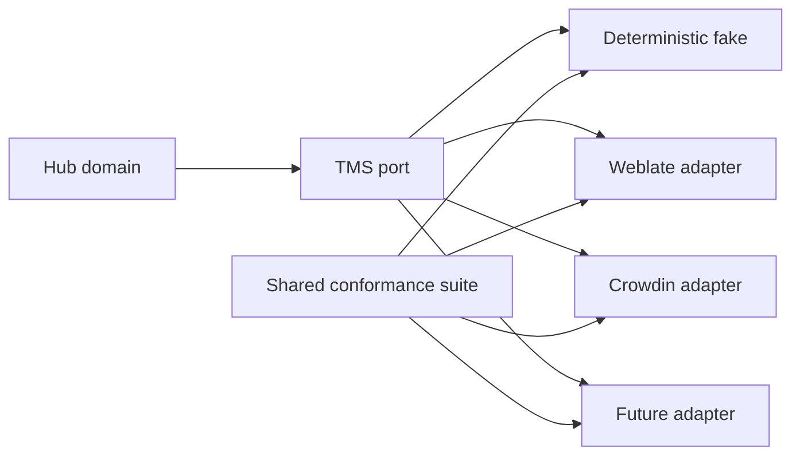
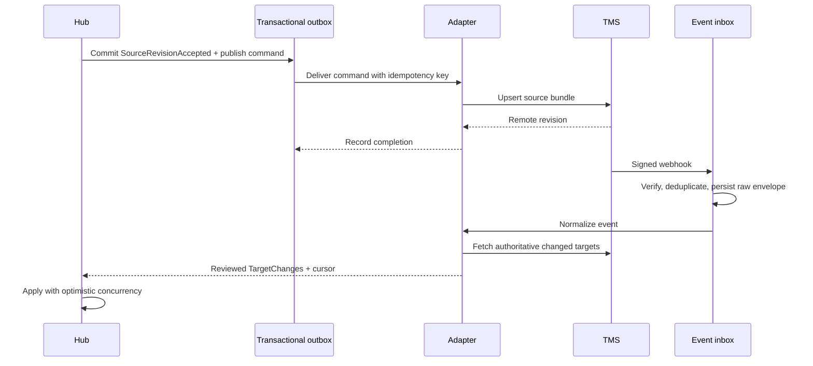
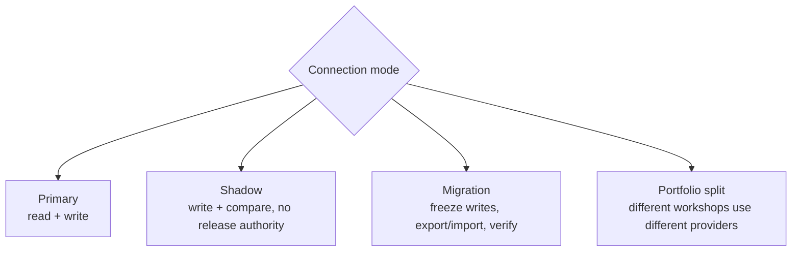
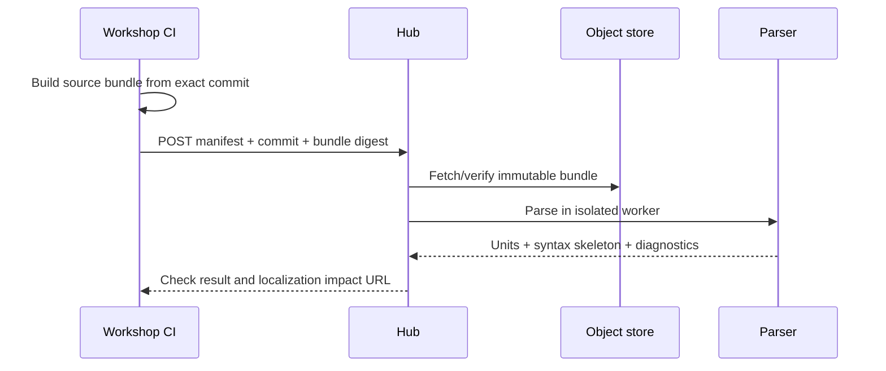
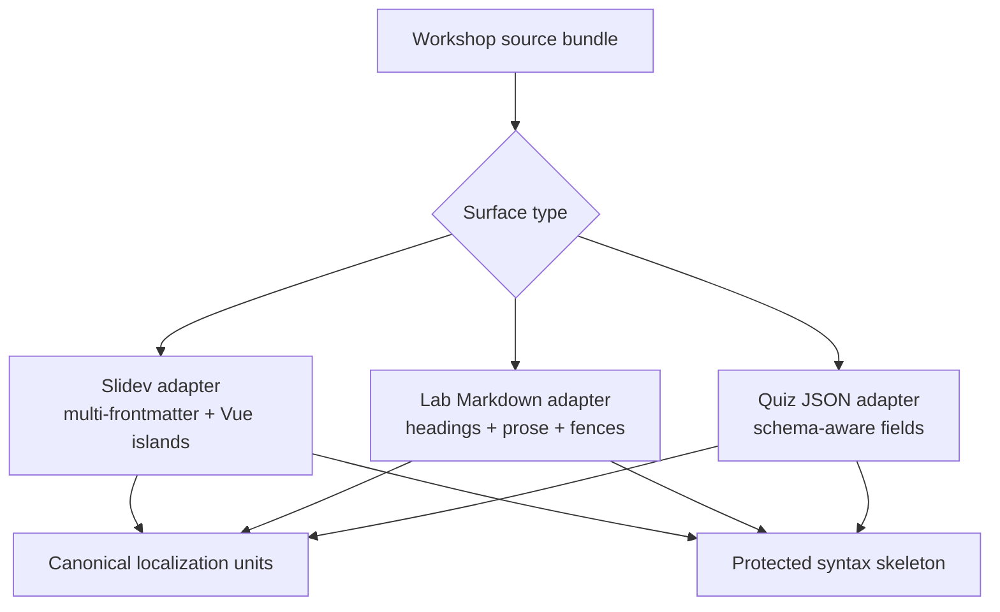
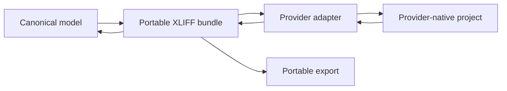
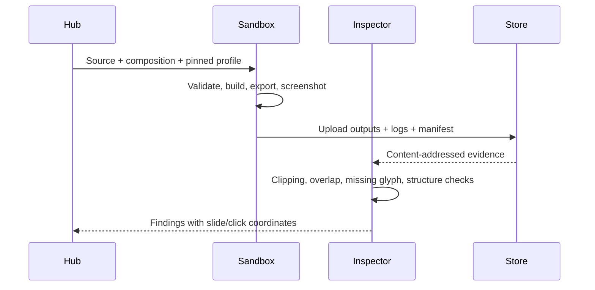

# Integration architecture

## Ports and adapters



The provider-neutral port represents capabilities, not one provider's resource model.

```ts
interface TranslationBackend {
  capabilities(): Promise<BackendCapabilities>
  ensureWorkspace(input: WorkspaceSpec): Promise<WorkspaceRef>
  publishSource(input: SourceBundle, key: IdempotencyKey): Promise<PublishResult>
  archiveSource(input: ArchiveRequest, key: IdempotencyKey): Promise<void>
  importReviewedTargets(cursor: ChangeCursor): AsyncIterable<TargetChange>
  getUnitLink(identity: UnitIdentity, locale: Locale): Promise<URL | undefined>
  mapWorkflowState(remote: RemoteState): NormalizedLinguisticState
  verifyWebhook(request: SignedRequest): Promise<VerifiedBackendEvent>
  health(): Promise<BackendHealth>
}
```

No code outside an adapter may use remote project IDs, status names, pagination tokens, rate-limit
headers, or webhook payloads.

## Capability negotiation

Providers differ. Pretending otherwise produces a leaky abstraction. An adapter declares support:

```yaml
workflow:
  linguisticReview: native
  sourceReview: native
  customStates: emulated
interchange:
  xliff21: native
  stableExternalIds: native
  inlineCodes: native
context:
  screenshots: native
  deepLinks: native
automation:
  webhooks: native
  incrementalPull: native
  idempotentUpload: emulated
```

The workshop policy states required capabilities. Connection setup fails early if the selected
adapter cannot meet them. Emulated capabilities must be covered by the same conformance scenarios as
native ones.

## Synchronization protocol



Webhooks are hints, not authoritative state. They trigger a pull using a durable cursor. This handles
lost, duplicate, delayed, and out-of-order delivery without trusting webhook order.

## Two-provider modes



- **Primary:** normal production operation with one authoritative provider per workshop/locale.
- **Shadow:** publish a synthetic or consented corpus to a second adapter and compare normalized
  behavior; never merge target translations from two providers.
- **Migration:** use XLIFF and translation-memory exports, freeze provider writes briefly, import,
  reconcile every identity and review state, then change authority.
- **Portfolio split:** the two workshops may select different providers while sharing the same hub.

Dual-writing live translator edits to two independent TMS products is intentionally unsupported. It
creates irreconcilable concurrent sources of truth and a hostile translator experience.

## Workshop source integration



The hub does not clone arbitrary pull-request URLs with broad credentials. Workshop CI uploads or
authorizes an immutable archive, and the hub verifies repository, commit, manifest, and digest.

## Content adapters



All adapters implement the same lifecycle:

1. `detect` whether the resource is supported;
2. `extract` units plus raw protected slices;
3. `validate` explicit identity and authoring contract;
4. `compose` reviewed target units into a clone of the source syntax tree;
5. `assertInvariants` against the recorded skeleton;
6. `serialize` deterministically; and
7. `explain` any diagnostic with source location and remediation.

## XLIFF boundary



XLIFF is the archival interchange and escape hatch, not the domain database and not necessarily the
provider upload format. The portable profile targets XLIFF 2.1; an adapter may use a provider-native
API or a proven provider-supported XLIFF subset. It must prove semantic round trips for IDs, inline
codes, source revisions, target text, normalized state, notes, and context links. Unsupported
portable metadata stays in the hub and must not silently disappear.

## Rendering contract

Each workshop supplies a pinned, containerized render profile:

```yaml
apiVersion: localization.workshops.dev/v1alpha1
kind: RenderProfile
spec:
  image: registry.example/workshop-renderer@sha256:...
  commands:
    validate: ["pnpm", "localization:validate"]
    build: ["pnpm", "build:localized"]
    export: ["pnpm", "export:localized"]
  outputs:
    interactive: dist/**
    pdf: dist-pdf/**
    screenshots: dist-render/**
  limits:
    cpu: "4"
    memory: 8Gi
    timeout: 20m
    network: none
```



## Versioning

- Workshop manifests, CLM records, events, and API payloads carry explicit schema versions.
- Adapters declare the hub contract versions they implement.
- Additive changes are preferred; breaking changes require parallel readers and a migration fixture.
- Stored raw provider envelopes remain readable by the adapter version that accepted them.
- Release artifacts record all schema and tool versions needed for reproduction.
