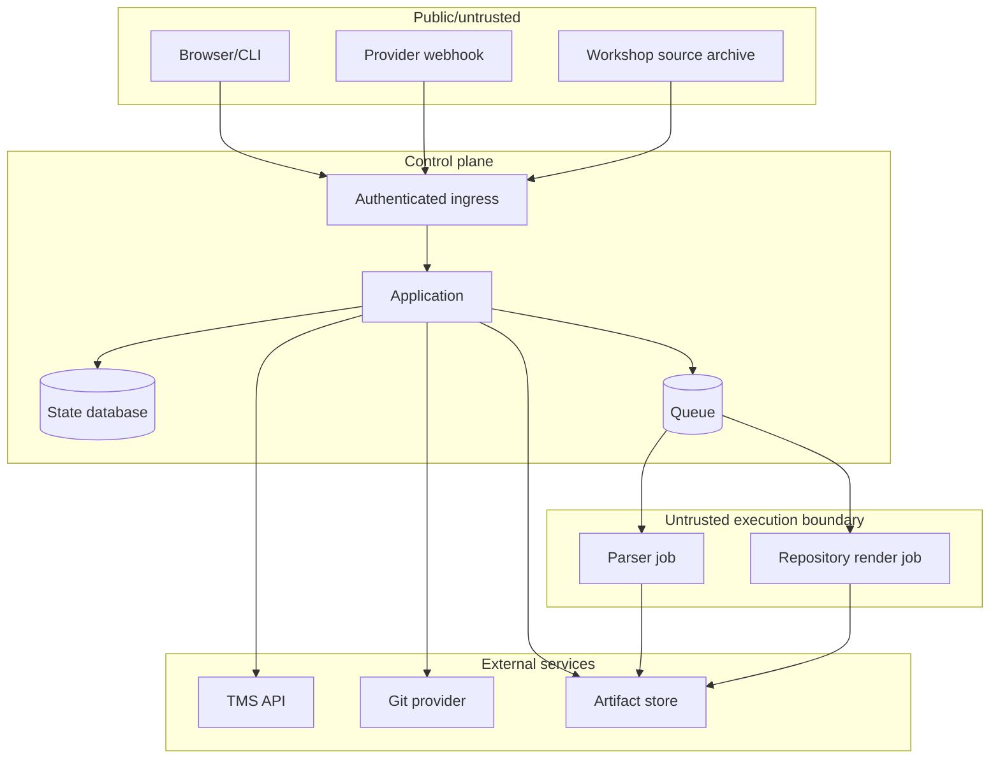
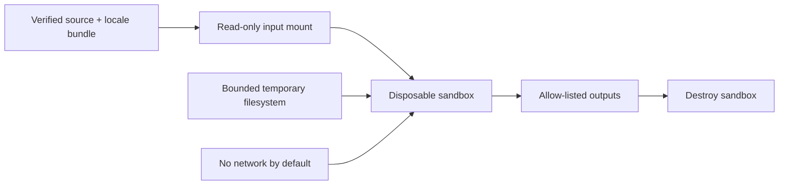
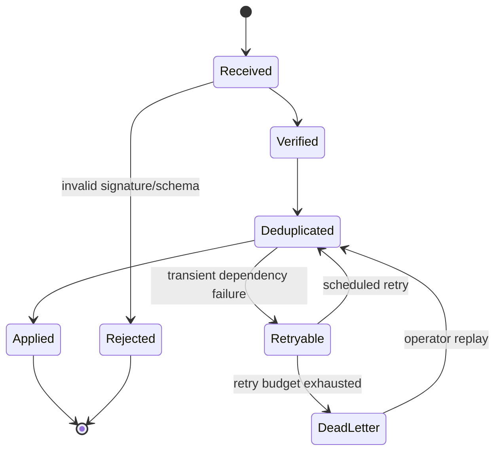
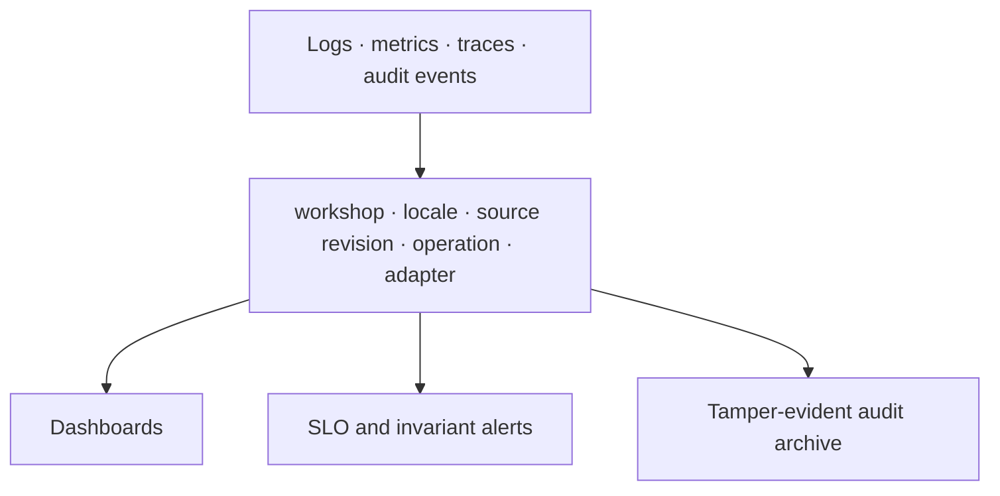
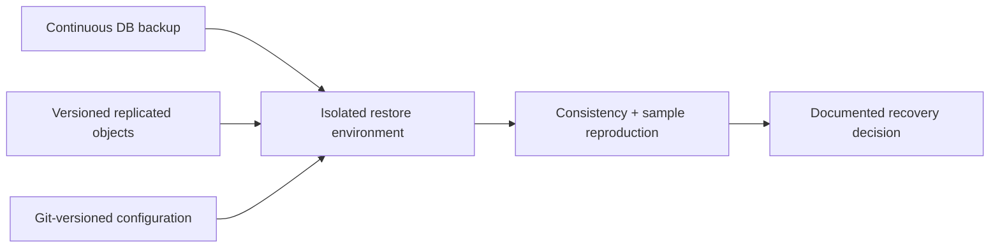

# Operations and security

## Service objectives

The hub is not on the live presentation request path, so correctness and recoverability take
precedence over millisecond latency.

| Indicator | Initial objective |
| --- | --- |
| Accepted source revision visible in dashboard | 99% within 10 minutes |
| Reviewed provider change imported | 99% within 15 minutes |
| Duplicate event causes duplicate semantic change | 0 |
| Released artifact reproducible from recorded inputs | 100% sampled releases |
| Incorrectly released stale/unreviewed required unit | 0 |
| API availability | 99.9% monthly |
| Recovery point objective | 15 minutes |
| Recovery time objective | 4 hours |

## Trust boundaries

Repository content, translation targets, XLIFF payloads, provider events, archives, and render scripts
are untrusted input. Linguistic review does not make content safe to execute.

## Authorization

| Action | Author | Translator | Linguistic reviewer | Visual reviewer | Operator | Release manager |
| --- | --- | --- | --- | --- | --- | --- | --- |
| Submit source revision | Yes | No | No | No | Yes | No |
| Edit translation | In TMS policy | Yes | Yes | No | No | No |
| Accept linguistic review | No | No | Yes | No | No | No |
| Approve visual composition | No | No | Optional | Yes | No | No |
| Replay failed job | No | No | No | No | Yes | No |
| Change provider connection | No | No | No | No | Yes | No |
| Publish release | No | No | No | No | Emergency only | Yes |

Separation of duties is configurable for small communities, but the audit log must show when one
person holds multiple roles. Service identities receive narrower permissions than people.

## Secret and credential model

- Prefer workload identity/OIDC over stored cloud credentials.
- Use installation-scoped Git app tokens, not personal access tokens.
- Use separate TMS credentials per environment and adapter.
- Fetch secrets just in time; never place them in job payloads or artifacts.
- Redact known token formats and provider payload authorization fields from telemetry.
- Rotate without downtime by supporting overlapping credential versions.
- Test revoked, expired, under-scoped, and over-scoped credentials.

## Render isolation

Jobs run as non-root with a read-only root filesystem, dropped capabilities, resource quotas,
deadline, process limit, seccomp policy, and no host/container socket. Dependencies are prebuilt into
the pinned renderer image. Exceptions to network denial are explicit per render profile and logged.

## Event reliability

Raw event envelopes are retained for a bounded period with sensitive fields redacted or encrypted.
The inbox records provider, event ID, payload digest, received time, signature result, processing
attempts, normalized outcome, and correlation ID.

## Observability

Required dashboards:

- source-ingestion latency and failures;
- provider sync lag, rate limits, cursor age, and webhook verification failures;
- translation state and staleness by workshop/locale;
- queue depth, retries, dead letters, and oldest job;
- composition/structural/visual failures by content construct and layout;
- render duration, resource use, and sandbox violations;
- release readiness and evidence age; and
- adapter conformance recency.

Alerts identify an operator action. “Translation incomplete” is product state, not an incident.

## Backup, restore, and disaster recovery

- PostgreSQL uses point-in-time recovery and encrypted backups.
- Object storage uses versioning, retention, and cross-failure-domain replication.
- TMS exports and XLIFF portability snapshots run regularly; a provider is not the sole copy.
- Restore drills occur at least quarterly and before major storage migrations.
- A drill reproduces one historical locale release, not merely “database started successfully.”

## Release integrity

Release publication is a two-phase operation:

1. assemble all artifacts and evidence under a temporary immutable prefix;
2. verify digests, policy, provenance, and visibility;
3. atomically publish a small release pointer/manifest; and
4. sign or attest the manifest using the release identity.

The public release index reads only published manifests, so a failed upload cannot expose a partial
workshop.

## Data retention and privacy

- Translation content and public contributor identity may be long-lived project records.
- Authentication events, IP addresses, and raw webhook payloads have shorter documented retention.
- Avoid storing provider profiles when a stable external subject ID suffices.
- Support contributor attribution/license requirements without copying unnecessary personal data.
- Deletion/anonymization workflows preserve the integrity of released artifacts and audit decisions.

## Runbook minimums

Before production, operators need tested runbooks for:

- provider outage or API incompatibility;
- webhook-signing-key rotation;
- stuck cursor and full reconciliation;
- dead-letter inspection and replay;
- corrupt or malicious source bundle;
- renderer sandbox violation;
- database restore and object reconciliation;
- accidental source revision publication;
- compromised integration credential; and
- withdrawal/replacement of a faulty locale release.

