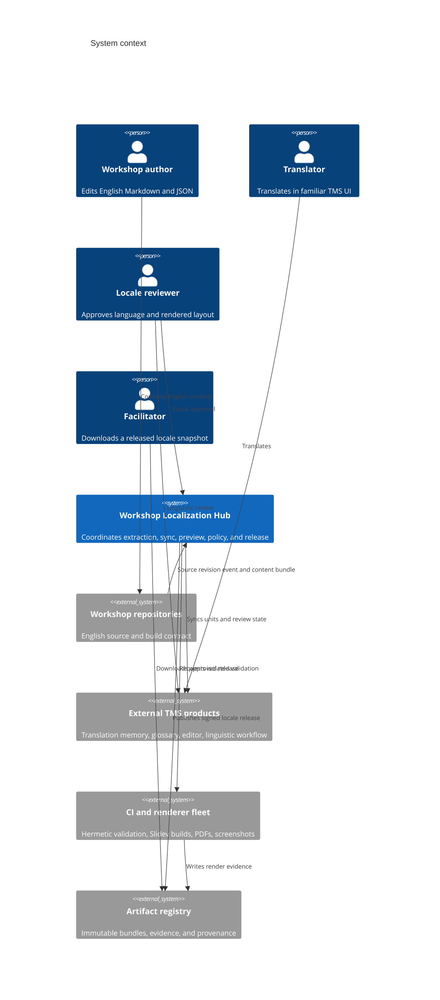
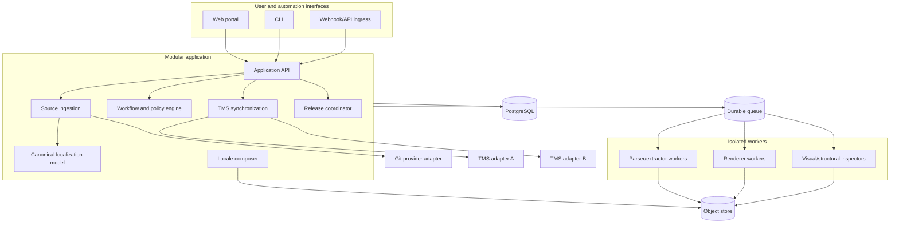
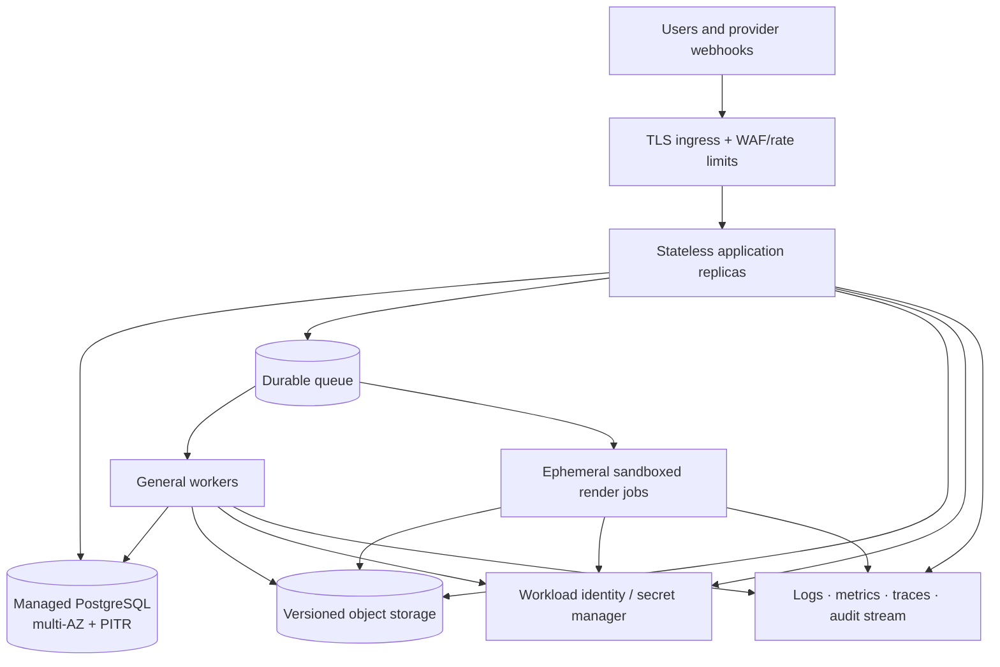

# System architecture

## Product boundary

The localization hub is a control plane between workshop repositories, one or more external TMS
products, and deterministic renderers. It stores orchestration state and evidence; it does not own
English authoring or provide the primary translation editor.



## Container view



### Why a modular monolith

The hard problem is correctness across a state machine, not independent scaling of dozens of
services. One deployable application keeps transactions, migrations, local development, and tracing
comprehensible. CPU- and memory-heavy parsing/rendering run in isolated workers so they can scale and
fail independently. Module boundaries are enforced in code and tests; they can become services only
after measured pressure justifies it.

## Source-to-release pipeline

```mermaid
flowchart LR
  Commit["English commit"]
  Manifest["Validate workshop manifest"]
  Extract["Parse into lossless syntax trees"]
  CLM["Build canonical units"]
  Diff["Semantic diff against prior revision"]
  Push["Push changed units"]
  Translate["Translate and review in TMS"]
  Pull["Import reviewed targets"]
  Compose["Compose locale source + overrides"]
  Verify["Structural and terminology gates"]
  Render["Build decks, labs, quiz, PDFs"]
  Visual["Automated + human visual review"]
  Publish["Publish immutable release"]

  Commit --> Manifest --> Extract --> CLM --> Diff --> Push --> Translate --> Pull --> Compose
  Compose --> Verify --> Render --> Visual --> Publish
```



Every box consumes immutable input and produces a content-addressed output. Retrying a stage with
the same inputs must produce the same semantic result. Side effects use idempotency keys.

## Repository topology

The code should live outside either workshop repository:

```text
workshop-localization-hub/
├── apps/
│   ├── api/                 # HTTP API and webhook ingress
│   ├── web/                 # operator/reviewer portal
│   ├── worker/              # parser, composer, renderer orchestration
│   └── cli/                 # local and CI entrypoint
├── packages/
│   ├── domain/              # entities, state machine, policies
│   ├── content-slidev/      # lossless Slidev adapter
│   ├── content-markdown/    # lab adapter
│   ├── content-quiz-json/   # quiz adapter
│   ├── interchange-xliff/   # portable XLIFF archive/import/export profiles
│   ├── tms-contract/        # provider-neutral port + conformance kit
│   ├── tms-weblate/         # first independent adapter
│   ├── tms-crowdin/         # second independent adapter
│   ├── git-contract/        # Git provider port
│   ├── render-contract/     # hermetic workshop build protocol
│   └── test-corpus/         # adversarial and real-world fixtures
├── features/                # executable user stories
├── deploy/                  # reproducible deployment definitions
├── docs/                    # architecture, operations, and ADRs
└── tools/                   # migration and fixture tooling
```

Workshop repositories contain only a small declarative contract:

```yaml
# .localization/workshop.yaml
apiVersion: localization.workshops.dev/v1alpha1
kind: WorkshopLocalization
metadata:
  id: kubernetes-practitioner
spec:
  sourceLanguage: en
  locales: [de, pt-BR]
  surfaces:
    - type: slidev
      include: pages/**/index.md
    - type: lab-markdown
      include: labs/**/*.md
    - type: quiz-json
      include: quiz/questions.json
  protectedTerms: .localization/terminology.yaml
  renderProfile: .localization/render.yaml
```

## Deployment view



Render jobs are untrusted-code workloads because workshop builds execute repository-defined package
scripts. They run without long-lived credentials, with read-only source, bounded CPU/memory/time,
restricted egress, and a disposable filesystem.

## Quality attributes

| Attribute | Architectural response |
| --- | --- |
| Correctness | Immutable revisions, semantic diff, state-machine invariants, content hashes |
| Usability | Role-specific inboxes, deep links to TMS units, rendered side-by-side previews |
| Portability | Canonical model, XLIFF interchange, provider-neutral adapter contract |
| Scalability | Queue-backed workers, content-addressed artifacts, incremental extraction/rendering |
| Testability | Pure domain modules, fakes, conformance kit, hermetic renderer protocol |
| Recoverability | Idempotent events, replayable jobs, audit log, database PITR, versioned artifacts |
| Security | Least-privilege apps, signed webhooks, sandboxed renders, no tokens in artifacts |
| Operability | Correlation IDs, per-revision dashboards, dead-letter replay, explicit SLOs |
