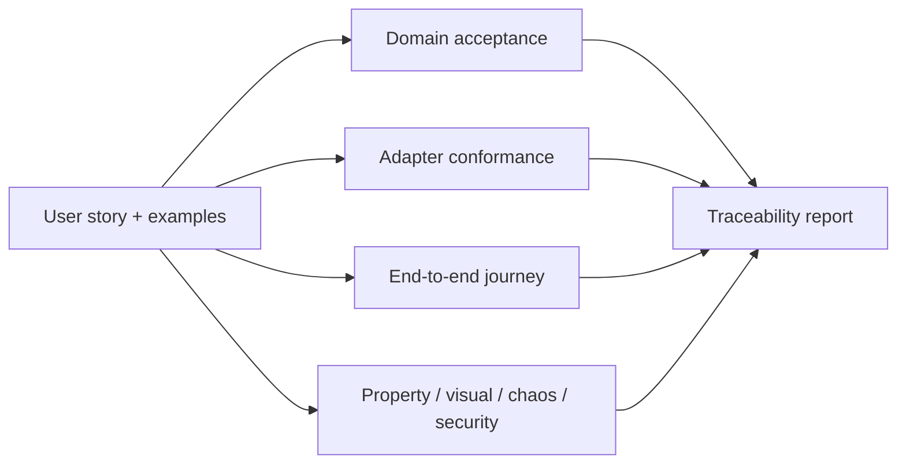
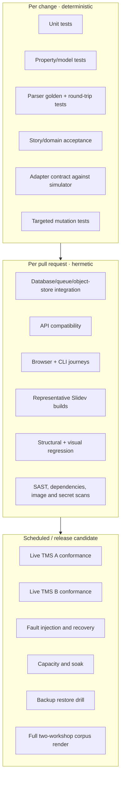
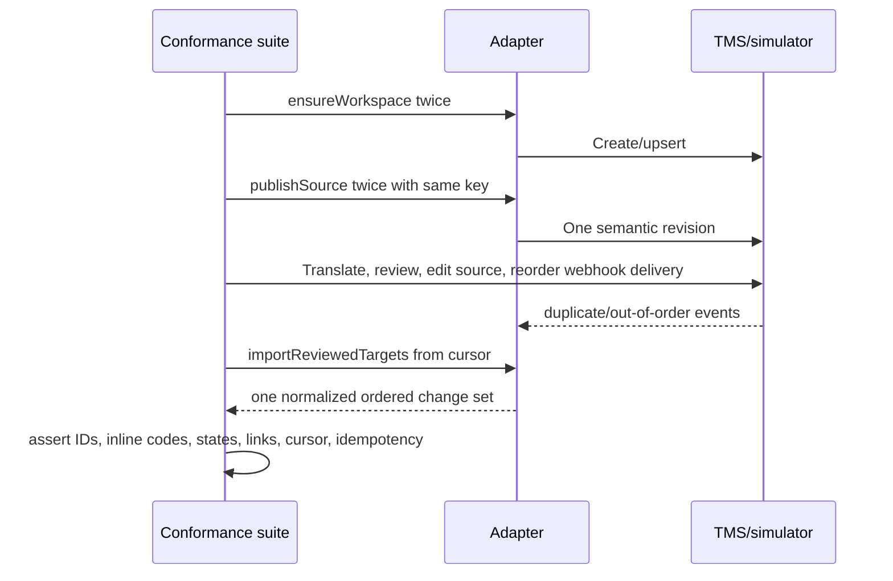
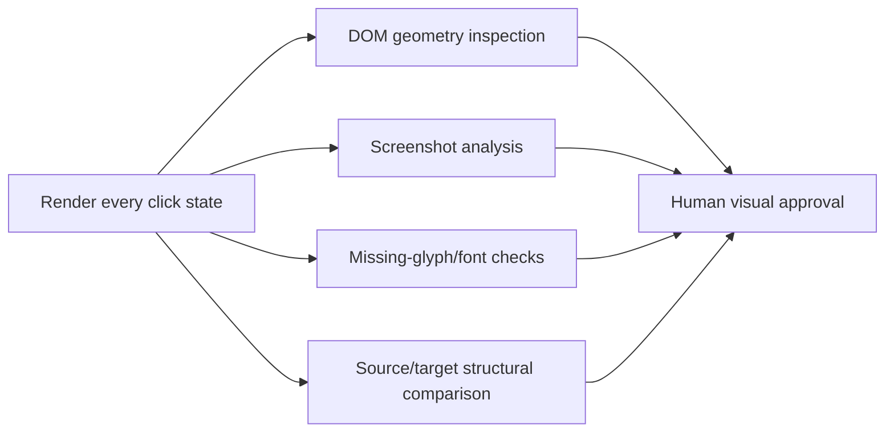

# Testing strategy

“Extremely well tested” is a repository policy, not an aspiration. Every user story is executable,
runs at multiple layers, and is exercised against every production TMS adapter through one
conformance contract.

## Story-to-test rule

Every feature under `features/` must have:

1. at least one domain-level acceptance test using deterministic fakes;
2. adapter-conformance scenarios for every supported TMS;
3. at least one end-to-end happy or failure journey through the public API/CLI;
4. relevant property, structural, visual, security, or recovery tests; and
5. traceability from story → scenarios → test runs → release evidence.

No story is “covered” solely because a line-coverage tool touched its implementation.



## Executable-story example

```gherkin
Feature: English changes invalidate only affected locale approvals

  Rule: A semantic source edit requires human revalidation

    Scenario: Reviewed body text changes but the slide ID remains stable
      Given slide "S00.statement-why" body "promise" is reviewed in German
      And its rendered German slide is visually approved
      When the English body changes semantically
      Then the German body is "needs-editing"
      And the German visual approval is invalidated
      And unrelated units remain reviewed
      And the locale cannot be released
```

The same scenario is bound to:

- an in-memory backend for fast domain acceptance;
- the Weblate adapter conformance environment;
- the Crowdin adapter conformance environment; and
- an end-to-end system test using the deterministic TMS simulator.

Live provider sandboxes run on a schedule and before adapter releases, not on every contributor pull
request. This preserves deterministic CI while still detecting real API drift.

## Test architecture



## Required suites

### Domain and state-machine tests

- Model-based tests generate valid and invalid event sequences.
- Invariants assert that release is impossible with stale, missing, structurally invalid, or
  visually unapproved required units.
- Approval invalidation is tested for every input hash.
- Commands are tested for idempotency and optimistic-concurrency conflicts.
- Clock, ID generation, storage, queue, and providers are injected dependencies.

### Parser and composer tests

The test corpus contains real workshop sections and minimized adversarial fixtures:

- multi-frontmatter Slidev documents;
- speaker notes in HTML comments;
- Vue components with props, slots, directives, and expressions;
- nested Markdown and raw HTML;
- magic-move blocks and nested fences;
- tables, links, inline code, emoji, combining characters, RTL, and CJK;
- malformed syntax with precise diagnostics;
- labs with executable and transcript fences; and
- quizzes with reordered options and stable answer IDs.

Properties:

```text
compose(source, extract(source, source_language)) == semantic_normalize(source)
protected_skeleton(compose(source, target)) == protected_skeleton(source)
extract(serialize(parse(source))) == extract(source)
compose(source, same_target) is deterministic
compose(compose(source, target), target) is rejected or stable by contract
```

Property-based generators mutate whitespace, ordering where legal, Unicode, line endings, source
locations, and translatable text. Fuzzing targets parser boundaries and never executes generated
content.

### Golden tests

Golden fixtures record:

- canonical units and identities;
- XLIFF output;
- protected skeletons;
- composed locale Markdown/JSON;
- diagnostics; and
- release manifests.

Golden changes require human review and a reason. They are not bulk-regenerated merely to make CI
green.

### TMS adapter conformance



The suite covers:

- workspace/project creation and discovery;
- initial and incremental source publication;
- rename, obsolete, split, and joined units;
- Unicode and inline-code preservation;
- review-state normalization;
- screenshot/context attachment;
- pagination and resumable cursors;
- duplicate and out-of-order webhooks;
- rate limits, timeouts, partial responses, and provider 5xx errors;
- token expiry and permission loss;
- export/import portability; and
- provider cleanup in isolated test namespaces.

An adapter cannot be labelled production-supported until it passes all mandatory capabilities in a
live disposable project.

### Visual tests



Automated checks detect clipping, overflow, invisible text, element collisions, unexpected scroll,
missing glyphs, render exceptions, blank slides, and lost click states. Pixel diffs are advisory
because translated text legitimately changes geometry. Human approval remains mandatory for release.

### End-to-end journeys

Browser and CLI tests exercise at minimum:

- onboard a workshop;
- ingest source and explain its localization impact;
- translate and review through the TMS simulator;
- inspect a rendered locale side by side;
- request and approve an override;
- release and verify a bundle;
- process a new English revision and observe selective invalidation;
- rotate a provider credential;
- replay a dead-lettered event; and
- migrate a locale between simulated providers.

### Reliability and chaos tests

- Kill a worker after each durable write and before acknowledgement.
- Deliver every external event zero, one, and many times in arbitrary order.
- Introduce provider latency, throttling, malformed pages, and cursor invalidation.
- Corrupt an object and prove digest verification blocks use.
- Interrupt a release midway and prove no partial release becomes visible.
- Restore the database and object store to a chosen recovery point.
- Run a 24-hour sync/render soak using both workshop corpora.

### Security tests

- Webhook signature and replay-window tests.
- Authorization matrix tests for author, translator, linguistic reviewer, visual reviewer, operator,
  and release manager.
- Tenant/workshop isolation tests on every query boundary.
- Malicious archive, path traversal, symlink, decompression-bomb, and parser-fuzz fixtures.
- Sandboxed-render escape and forbidden-network assertions.
- Secret scanning and redaction tests for logs, traces, artifacts, and diagnostics.
- Dependency, container, infrastructure, and API dynamic scanning.

## Quality gates

| Gate | Pull request | Main | Release candidate |
| --- | --- | --- | --- |
| Unit/domain/property | Required | Required | Required |
| Parser corpus and golden | Required | Required | Required |
| Adapter contract vs simulator | Required | Required | Required |
| Database/API integration | Required | Required | Required |
| Representative render/visual | Required | Required | Required |
| Full two-workshop corpus | Changed surfaces | Required | Required |
| Live provider conformance | No | Scheduled | Required |
| Mutation testing | Changed critical modules | Scheduled full | Threshold required |
| Chaos/load/restore | No | Scheduled | Latest run must be current |
| Security and provenance | Required subset | Required | Required full |

Initial coverage policy:

- 100% branch coverage for release policy, state transitions, identity migration, protected-content
  validation, and authorization decisions;
- high project-wide coverage with no arbitrary number used as a substitute for meaningful tests;
- mutation score of at least 90% on the critical modules above; and
- every production incident adds a minimized regression fixture before closure.

## Test observability

Every scenario emits a trace with story ID, scenario ID, adapter, workshop fixture, source revision,
and correlation ID. A generated traceability report answers:

```text
Which stories have no adapter coverage?
Which production adapters have not passed live conformance recently?
Which release-policy branches survived mutation?
Which workshop syntax constructs exist in production but not the corpus?
Which visual approvals were produced by an obsolete render profile?
```

