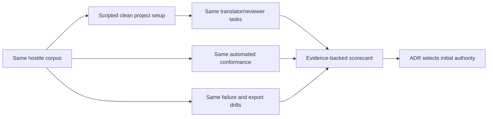
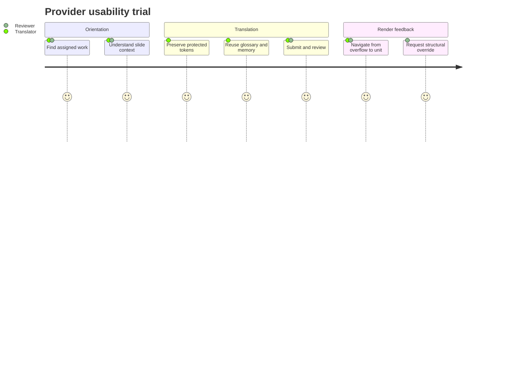

# TMS evaluation

The architecture intentionally does not declare a provider winner from feature lists. The first
production authority is chosen through a scripted bake-off using the real hostile corpus, real
German and Brazilian Portuguese reviewers, and the same conformance stories.

## Candidate posture

The first two adapters target:

- **Weblate:** self-hostable/open-source option with review workflow, translation memory, glossary,
  context, screenshot, and API capabilities. Its current documentation labels direct Markdown and
  XLIFF 2 support as under development, so the adapter must prove its exact native/API or file
  profile rather than relying on format claims.
- **Crowdin:** managed-service candidate with translation workflow, memory, glossary, webhooks, and
  APIs. The adapter must pass the same live contract and export-portability tests; managed operation
  is not evidence of semantic correctness.

This is not a requirement to dual-write production translations. One provider is authoritative for
each workshop/locale; the second is independently tested, available for a portfolio split or future
migration, and may run a consented shadow corpus.

## Evaluation flow

## Weighted scorecard

| Dimension | Weight | Evidence, not sales claims |
| --- | ---: | --- |
| Translator and reviewer usability | 25 | Task success, time, errors, SUS-style feedback, accessibility |
| Identity and source-change correctness | 15 | Live conformance for edit/move/obsolete/split/retry scenarios |
| Workflow and permissions | 10 | Dedicated review, locale roles, audit history, API state mapping |
| Context quality | 10 | Notes, screenshots, neighboring strings, deep links, protected tokens |
| API/webhook reliability | 10 | Pagination, cursor/reconciliation, rate limits, signatures, idempotency |
| Portability and exit | 10 | Complete exports, reproducible import, identity/state loss report |
| Cross-workshop memory and glossary | 10 | Shared suggestions without project-state leakage |
| Operations/security/compliance | 5 | Hosting model, backup, SSO, token scopes, incident posture |
| Sustainable cost and community fit | 5 | Transparent three-year scenario for contributors/locales/workshops |

A provider must also pass all non-negotiable gates; weighted strength cannot compensate for failed
protected-content integrity, missing review authority, inability to export accepted translations, or
unreliable identity.

## Moderated usability script

Each participant performs the same tasks without repository access:

1. find a newly changed German unit from an assignment;
2. understand where it appears using notes and screenshot context;
3. translate prose containing protected inline Kubernetes terms;
4. use glossary and cross-workshop translation-memory suggestions;
5. submit the unit for review;
6. review another translator's unit and request a correction;
7. follow a rendered-overflow deep link back to the exact unit;
8. request a structural override; and
9. determine why a seemingly complete locale cannot release.

Capture task success, assistance needed, wrong turns, elapsed time, token corruption attempts, review
state mistakes, and qualitative confidence. Five skilled participants per role/locale is a useful
initial qualitative sample; it is not treated as statistical proof.

## Technical trial corpus

The trial must include:

- a Slidev section with multi-frontmatter, Vue components, slots, speaker notes, magic-move, nested
  fences, and click states;
- a contracted lab with prose, tables, inline code, multiple executable fences, and solution links;
- structured quiz JSON with stable question/option IDs and immutable answer identity;
- duplicate English prose used in different contexts;
- source edit, file move, slide insertion, unit split/join, obsolete unit, and terminology change;
- German overflow requiring one real slide split; and
- Portuguese content imported from the community contribution as migration evidence.

## Provider decision record

The later selection ADR includes:

- version/date and hosting tier tested;
- configuration-as-code or reproducible setup procedure;
- raw conformance and usability evidence;
- capability gaps and hub-side emulations;
- export/migration results;
- three-year operating/cost assumptions;
- selected authority and fallback adapter;
- triggers for reevaluation; and
- confirmation that no provider-specific model leaked into the domain.

## Reevaluation triggers

- mandatory live conformance fails for two consecutive supported provider releases;
- export loses accepted target identity or review evidence;
- material API, pricing, hosting, licensing, or security change;
- translators' task success drops below the accepted baseline;
- a third workshop requires a missing mandatory capability; or
- provider-specific emulation becomes a significant part of the hub.

## References

- [Weblate translation workflows](https://docs.weblate.org/en/latest/workflows.html)
- [Weblate translator context and screenshots](https://docs.weblate.org/en/latest/admin/translating.html)
- [Weblate XLIFF 2 support](https://docs.weblate.org/en/latest/formats/xliff2.html)
- [Crowdin documentation](https://support.crowdin.com/)

