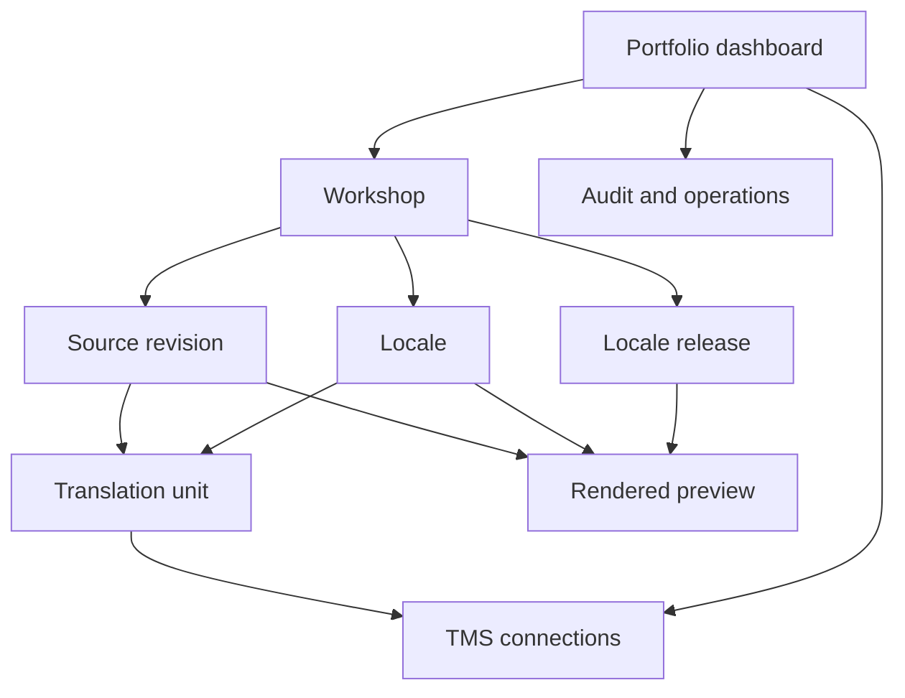
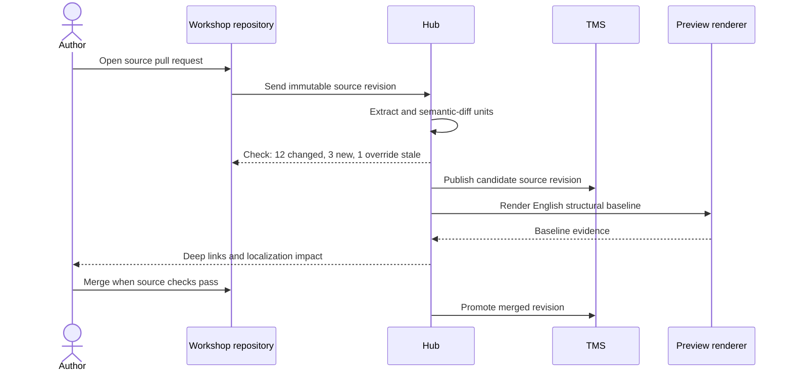
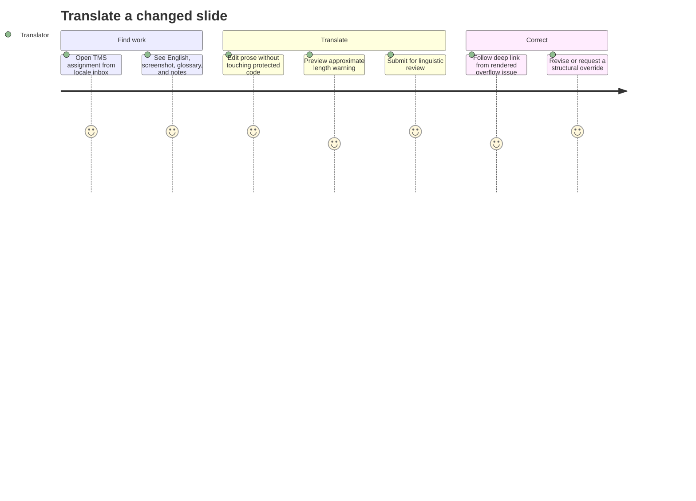
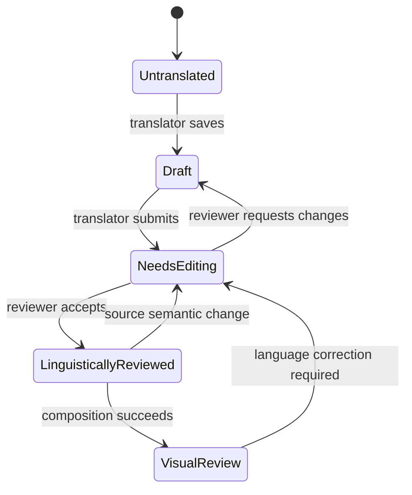
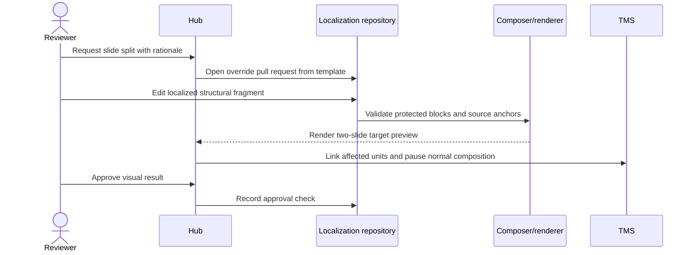
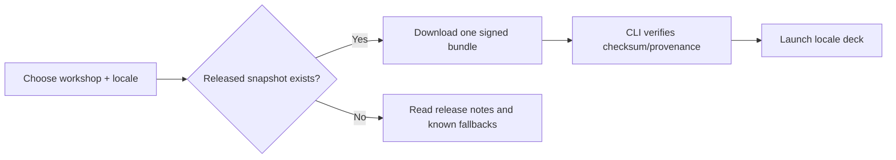
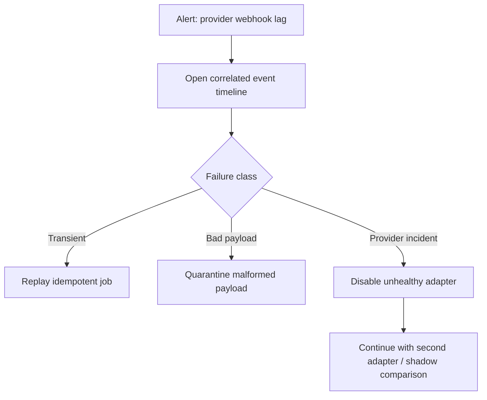

# Usability and journeys

The hub succeeds only if normal work is easier than editing translated Markdown by hand. Each role
gets one obvious inbox, actionable status, and a reversible workflow.

## Information architecture



## Portfolio dashboard

```text
┌─ Localization Hub ──────────────────────────────────────────────────────────┐
│ Workshops   Needs attention   Ready to release   Provider health           │
│     2             17                 1             A ✓  B ✓                │
├─────────────────────────────────────────────────────────────────────────────┤
│ Kubernetes Practitioner  source 8f31c2                                     │
│   de      96% linguistic  92% visual   3 stale   2 overflow   [Open]       │
│   pt-BR  100% linguistic 100% visual   ready                 [Release]     │
│ Infrastructure Workshop source a42e90                                     │
│   de      81% linguistic  79% visual  24 stale               [Open]       │
└─────────────────────────────────────────────────────────────────────────────┘
```

Percent complete is never the only signal. The dashboard distinguishes untranslated, needs-editing,
linguistically reviewed, structurally failed, visually failed, visually approved, and released.

## Author journey: change English safely



The author never edits keys or catalogs. A pull-request check explains localization impact before
merge without blocking English authoring on translation completion.

## Translator journey: work in a familiar editor



Each TMS unit includes:

- the English source and prior accepted translation;
- workshop, section, slide, role, and layout context;
- source and target screenshots when available;
- protected terms and non-translatable inline tokens;
- a deep link back to the hub preview;
- a character-expansion hint, clearly labelled as a hint rather than a layout guarantee.

## Linguistic reviewer journey



The reviewer works in the TMS, where translation memory and glossary context already exist. The hub
imports provider state but maps it to its own smaller, provider-independent state machine.

## Visual reviewer journey

```text
┌─ Visual review: de · S07 · Service types ───────────────────────────────────┐
│ Source revision 8f31c2   Linguistic review ✓   Structural checks ✓         │
├───────────────────────────────┬─────────────────────────────────────────────┤
│ English                       │ German                                      │
│ [rendered slide + click 0]    │ [rendered slide + click 0]                 │
│                               │                                             │
│ [click 1] [click 2] [click 3] │ [click 1] [click 2] [click 3]              │
├───────────────────────────────┴─────────────────────────────────────────────┤
│ Issues: text clipped in card 3 · line wrap changed card height             │
│ [Request wording change] [Create override request] [Approve visual]        │
└─────────────────────────────────────────────────────────────────────────────┘
```

Visual approval is bound to `(source revision, locale, composed-content hash, render-profile hash)`.
Any change to those inputs invalidates approval automatically.

## Override journey



Overrides require a reason: `overflow`, `locale-pedagogy`, `accessibility`, or `other`. The dashboard
reports override rate by locale and layout. Repeated overrides of one layout create an upstream
layout-improvement task instead of normalizing permanent forks.

## Facilitator journey



A facilitator never assembles catalogs or decides whether fuzzy strings are safe. A locale is either
released for a particular English revision or visibly unavailable. Preview builds may contain
watermarked English fallback; released builds may not.

## Operator journey



## Usability acceptance measures

| Measure | Initial target |
| --- | --- |
| Author actions to publish changed source units | Zero beyond normal pull request workflow |
| Translator navigation from task to source slide preview | One click |
| Reviewer navigation from visual defect to TMS unit | One click |
| Facilitator actions from released locale to running deck | One command or one download |
| Unexplained status labels | Zero; every state has cause and next action |
| Manual reconciliation after duplicate webhook | Zero |
| Time to reproduce a failed render locally | Under ten minutes from copied command |

