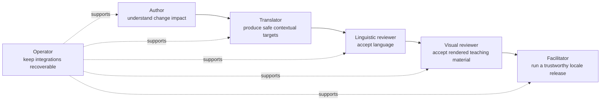
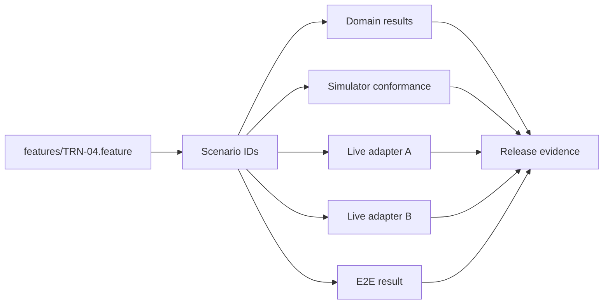

# User stories and traceability

These stories define the product contract. They are intentionally phrased independently of any TMS
screen or provider API. Scenario files in the future repository use the IDs below.

## Story map

## Author stories

| ID | Story | Key acceptance examples |
| --- | --- | --- |
| AUT-01 | As an author, I edit readable English rather than translation keys. | Extraction requires no prose rewrite; diagnostics point to source locations. |
| AUT-02 | As an author, I see localization impact before merging. | New, changed, obsolete, override-stale, and visually invalidated counts are separated. |
| AUT-03 | As an author, I can move a stable slide without losing translations. | Explicit IDs preserve target history across path and ordinal changes. |
| AUT-04 | As an author, I receive precise errors for unsafe source syntax. | Missing/duplicate IDs and ambiguous translatable boundaries block intake with remediation. |

## Translator stories

| ID | Story | Key acceptance examples |
| --- | --- | --- |
| TRN-01 | As a translator, I work in the selected TMS editor. | Source, target, notes, glossary, screenshot, and neighboring context are available. |
| TRN-02 | As a translator, I cannot accidentally alter executable material. | Protected inline codes and fences are read-only; hostile target imports are rejected. |
| TRN-03 | As a translator, I reuse terminology across both workshops. | Shared translation memory/glossary suggestions appear without sharing workflow state. |
| TRN-04 | As a translator, I see exactly what changed in English. | Previous source and target remain visible; changed units become needs-editing. |
| TRN-05 | As a translator, I request structural help when wording cannot fit. | One action links the unit, slide, screenshot, and proposed override reason. |

## Review stories

| ID | Story | Key acceptance examples |
| --- | --- | --- |
| LRV-01 | As a linguistic reviewer, I accept or return translations in the TMS. | Only authorized provider states normalize to reviewed; duplicate events apply once. |
| LRV-02 | As a linguistic reviewer, source changes invalidate affected approval. | Related unit becomes needs-editing; unrelated units retain approval. |
| VRV-01 | As a visual reviewer, I compare English and locale renders at every click. | Side-by-side render, issue coordinates, and deep links are available. |
| VRV-02 | As a visual reviewer, I approve exact render inputs. | Any source, target, override, font/toolchain, or render-profile change invalidates approval. |
| VRV-03 | As a visual reviewer, I split a crowded slide without forking the deck. | One stable source slide maps to multiple locale slides with protected blocks preserved. |

## Facilitator stories

| ID | Story | Key acceptance examples |
| --- | --- | --- |
| FAC-01 | As a facilitator, I download one complete locale bundle. | Deck, labs, quiz, PDF, manifest, and checksums share one source revision. |
| FAC-02 | As a facilitator, I cannot mistake a preview for a release. | Preview fallback is watermarked; released bundles contain zero fallback units. |
| FAC-03 | As a facilitator, I verify and run a release without TMS knowledge. | One command verifies provenance and launches the requested locale/day. |
| FAC-04 | As a facilitator, I understand replacement releases. | Withdrawn release points to its immutable replacement and reason. |

## Operator and portability stories

| ID | Story | Key acceptance examples |
| --- | --- | --- |
| OPS-01 | As an operator, I replay transient failures safely. | Worker death and repeated command cause one semantic side effect. |
| OPS-02 | As an operator, I reconcile lost or reordered provider events. | Cursor pull reaches authoritative state regardless of webhook delivery order. |
| OPS-03 | As an operator, I diagnose one revision end to end. | Correlated source, provider, composition, render, review, and release timeline exists. |
| OPS-04 | As an operator, I restore service and reproduce a release. | Point-in-time restore plus object versions reproduce sampled artifact digests. |
| SEC-01 | As an operator, I execute workshop builds without trusting them. | Sandbox denies network/privilege escape and exposes no long-lived credentials. |
| PRT-01 | As a maintainer, I can change TMS without losing accepted work. | Portable export/import preserves IDs, targets, provenance, and representable states. |
| PRT-02 | As a maintainer, I know when an adapter is not equivalent. | Capability negotiation blocks unsupported policy; shadow report explains differences. |

## Required multi-TMS matrix

Every row marked `C` is a mandatory adapter-conformance scenario. `U` is demonstrated in the TMS
usability trial because it depends on human interaction. `H` belongs to hub behavior and uses each
adapter as an input, but is not implemented by the TMS itself.

| Story | Simulator | Weblate | Crowdin | Domain/API | End to end | Specialist layer |
| --- | --- | --- | --- | --- | --- | --- |
| AUT-01..04 | H | H | H | Required | Required | Parser property/golden |
| TRN-01 | U | U | U | Contract metadata | Required | Moderated usability |
| TRN-02 | C | C | C | Required | Required | Security/fuzz |
| TRN-03 | C | C | C | Mapping | Required | Two-workshop corpus |
| TRN-04 | C | C | C | Required | Required | State-model test |
| TRN-05 | H | U | U | Required | Required | Usability |
| LRV-01..02 | C | C | C | Required | Required | Event permutation |
| VRV-01..03 | H | H | H | Required | Required | Visual/property |
| FAC-01..04 | H | H | H | Required | Required | Provenance/reproduction |
| OPS-01..04 | C | C | C | Required | Required | Chaos/restore/soak |
| SEC-01 | H | H | H | Authorization | Required | Sandbox/security |
| PRT-01 | C | C | C | Required | Required | Migration rehearsal |
| PRT-02 | C | C | C | Required | Required | Shadow comparison |

The two named adapters are candidates, not accepted dependencies. If either fails a mandatory story,
it is not called production-supported. A replacement adapter must satisfy the same matrix.

## Traceability artifact

CI fails when a story lacks its required bindings, even if all existing test files pass.

